# DE analysis using `StandR`: Normalization, Batch correction and DE analysis
### Author: Diana Vera Cruz
### Date: 03/31/2025

## StandR

This library was developed to facilitate GeoMx data analysis using the
more general `SpatialExperiment` object.

This script is inspired by the tutorial:

[StandR, GeoMx workflow](https://davislaboratory.github.io/GeoMXAnalysisWorkflow/articles/GeoMXAnalysisWorkflow.html)

We follow here the steps post-QC, including normalization, batch
correction and DE analysis.

## Input Data

`StandR` uses the alternative raw data consisting on raw counts,
metadata and feature annotation files. Typically in tabular format. If
not, you can load each of the datasets and ensure the correspondence in
the column names. The counts and features are done at the Gene level
instead of Probes, with all the probes associated to a given Gene
aggregated prior.

- **Counts**: Dataframe, or table, including a column with the gene name
  (Default, `TargetName`).

- **Sample Annotation**: Sample annotation, it should include a segment
  name column, (Default, `SegmentDisplayName`) and Coordinate columns
  (Default, `ROICoordinateX` and `ROICoordinateY`).

- **Features**: Optional, but if provided, it should include a column
  with the gene name (Default, `TargetName`).

In this case, we are using the output from the previous QC step with
`GeoMxTools`. All the mentioned tables were stored in proper format.

## SpatialExperiment object

StandR is based in the `SpatialExperiment` object, which is a subclass
of `SingleCellExperiment` object. The `SpatialExperiment` object is a
container for spatially resolved transcriptomics data, which includes
the raw counts, sample annotation and feature annotation.

Key object slots:

- assays: Matrix-like objects with expression data (counts, log-counts).
- colData: DataFrame with sample annotation.
- rowData: DataFrame with feature annotation.
- metadata: List with additional, general information of the study
  (sample-level info).
- imgData: Image and histology data.
- spatialCoords: Spatial coordinates.
- reducedDims: Dimensionality reduction results, PCA, UMAP.

``` r
## Set output directory.
out_dir = '../results'
## Create the SpatialExperiment Object.
spe = readGeoMx(countFile='../results/tidy_counts.tsv', 
          sampleAnnoFile='../results/tidy_metadata.tsv', 
          featureAnnoFile = '../results/tidy_features.tsv',
          colnames.as.rownames = c('TargetName', 'segment_name', 'TargetName'), 
          coord.colnames = c('ROI_Coordinate_X','ROI_Coordinate_Y')
)
```

    ## Rows: 10028 Columns: 202
    ## ── Column specification ───────────────────────────────────────────────────────────────────────────────────
    ## Delimiter: "\t"
    ## chr   (1): TargetName
    ## dbl (201): DSP-1001250007851-H-A02.dcc, DSP-1001250007851-H-A03.dcc, DSP-100...
    ## 
    ## ℹ Use `spec()` to retrieve the full column specification for this data.
    ## ℹ Specify the column types or set `show_col_types = FALSE` to quiet this message.
    ## Rows: 10028 Columns: 8
    ## ── Column specification ───────────────────────────────────────────────────────────────────────────────────
    ## Delimiter: "\t"
    ## chr (5): TargetName, Module, CodeClass, GeneID, SystematicName
    ## dbl (2): DetectedSegments, DetectionRate
    ## lgl (1): Negative
    ## 
    ## ℹ Use `spec()` to retrieve the full column specification for this data.
    ## ℹ Specify the column types or set `show_col_types = FALSE` to quiet this message.
    ## Rows: 201 Columns: 12
    ## ── Column specification ───────────────────────────────────────────────────────────────────────────────────
    ## Delimiter: "\t"
    ## chr (7): segment_name, slide_name, region, segment, class, aoi, pathology
    ## dbl (5): roi, area, nuclei, ROI_Coordinate_X, ROI_Coordinate_Y
    ## 
    ## ℹ Use `spec()` to retrieve the full column specification for this data.
    ## ℹ Specify the column types or set `show_col_types = FALSE` to quiet this message.

## Dataset exploration

### Dataset categories

``` r
plotSampleInfo(spe, column2plot = c("slide_name", "class","region", 'segment'))
```

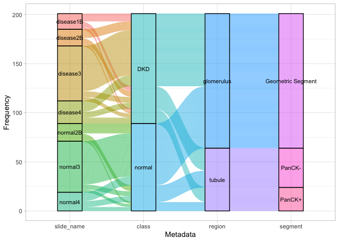<!-- -->

### Relative log expression distribution

GeoMx data tends to have high variation and batch effects, normally
associated to slides or individuals. We can check those variables to see
if they are affecting the data.

We can also check other variables that

``` r
plotRLExpr(spe, ordannots = "slide_name", assay = 2, color = `slide_name`) + labs(x = NULL, title = 'No norm')
```

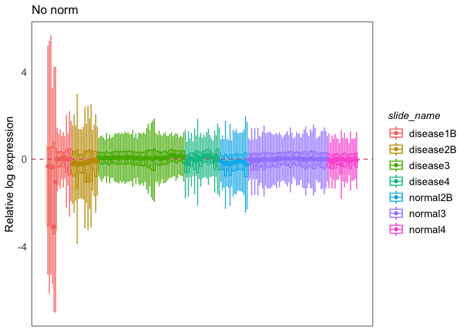<!-- -->

``` r
plotRLExpr(spe, ordannots = "slide_name", assay = 2, color = region) + labs(x = NULL, title = 'No norm')
```

<!-- -->

## Normalization

We will use the `geomxNorm` function to normalize the data. We will use
the `TMM` and `upperquartile` methods. Upperquartile normalization is
similar to the one suggested in GeoMxTools.

``` r
## Add initial normalization. 
spe_tmm <- geomxNorm(spe, method = "TMM")
spe_q3 <- geomxNorm(spe, method = "upperquartile")
```

``` r
plotRLExpr(spe_tmm, ordannots = "slide_name", assay = 2, color = `slide_name`) + labs(x = NULL, title = 'TMM')
```

<!-- -->

``` r
plotRLExpr(spe_q3, ordannots = "slide_name", assay = 2, color = `slide_name`) + labs(x = NULL, title = 'Q3')
```

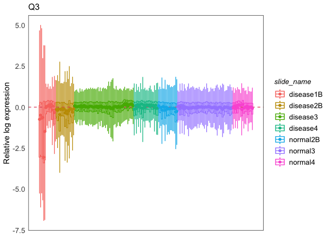<!-- -->

### PCA

We use PCAtools to compute the preliminary PCA using Q3 normalization,
in this case, we remove 5% of the genes with the lowest CV from the PCA
computation.

``` r
set.seed(100)
plotPairPCA(spe_q3, assay = 2, color = class, shape = region, title = "Q3")
```

    ## Loading required namespace: scater

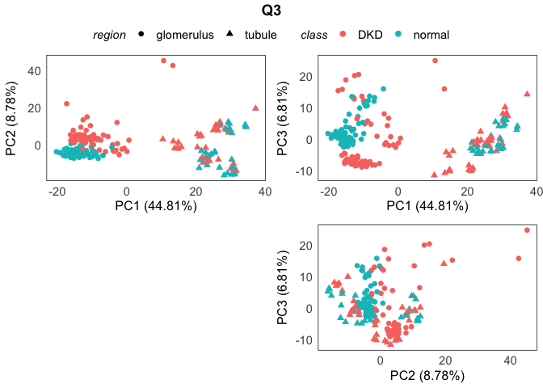<!-- -->

``` r
plotPairPCA(spe_q3, assay = 2, color = slide_name, shape = region, title = "Q3")
```

<!-- -->

## Batch correction

This step is done in the context of 2 key variables: Variable to use for
batch effect correction and the variable you want to maximize the
separation (Variable of interest)

### Initial PCA: no normalization

``` r
plotPairPCA(spe, assay = 2, n_dimension = 3, color = class, shape = region)
```

<!-- -->

``` r
plotPairPCA(spe, assay = 2, n_dimension = 3, color = slide_name, shape = region)
```

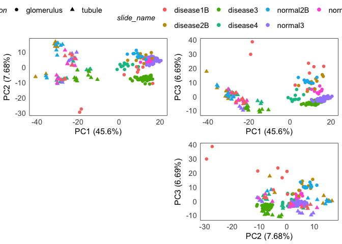<!-- -->

### `RUV4` method

This method requires to compute Negative Control genes per batch. top_n
is the number of genes with the lowest variation of expression used for
this.

**How to choose the best top_n?**

Check various values for top_n, if the Coefficient of variance (CV) in
the genes seems high, reduce top_n, remember that low top_n also affects
the performance of the method, so don’t go too low.

``` r
## Gather CV per genes: Use Raw counts 
genes_cv <- apply(counts(spe) + 1, 1, function(x) sd(x)/mean(x) ) %>% sort(decreasing = F)

## Histogram of the lowest 99% of the CVs. -> Avoid major outliers. 
hist(genes_cv[genes_cv <= quantile(genes_cv, p = 0.99)], breaks = 50, 
     main = 'CV per gene - 99%Quantile', xlab = 'CV')
```

<!-- -->

``` r
spe <- findNCGs(spe, batch_name = "slide_name", top_n = 1000)
```

    ## New names:
    ## • `cv` -> `cv...1`
    ## • `cv` -> `cv...2`
    ## • `cv` -> `cv...3`
    ## • `cv` -> `cv...4`
    ## • `cv` -> `cv...5`
    ## • `cv` -> `cv...6`
    ## • `cv` -> `cv...7`

``` r
hist(genes_cv[metadata(spe)$NCGs], breaks = 50, main = 'top_n = 1000', xlab = 'CV')
```

<!-- -->

``` r
## We are setting top_n to the top
spe <- findNCGs(spe, batch_name = "slide_name", top_n = 500)
```

    ## New names:
    ## • `cv` -> `cv...1`
    ## • `cv` -> `cv...2`
    ## • `cv` -> `cv...3`
    ## • `cv` -> `cv...4`
    ## • `cv` -> `cv...5`
    ## • `cv` -> `cv...6`
    ## • `cv` -> `cv...7`

``` r
hist(genes_cv[metadata(spe)$NCGs], breaks = 50, main = 'top_n = 500', xlab = 'CV')
```

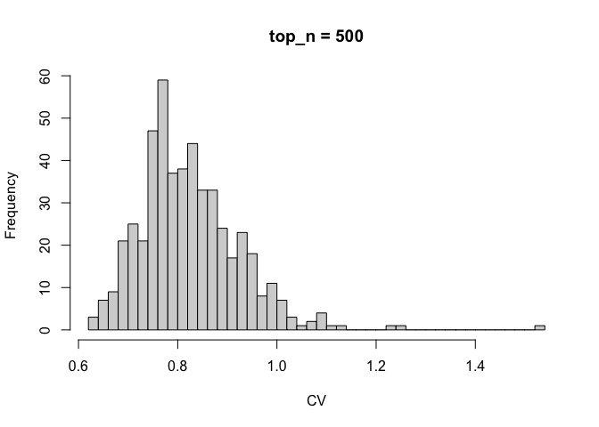<!-- -->

``` r
spe <- findNCGs(spe, batch_name = "slide_name", top_n = 300)
```

    ## New names:
    ## • `cv` -> `cv...1`
    ## • `cv` -> `cv...2`
    ## • `cv` -> `cv...3`
    ## • `cv` -> `cv...4`
    ## • `cv` -> `cv...5`
    ## • `cv` -> `cv...6`
    ## • `cv` -> `cv...7`

``` r
hist(genes_cv[metadata(spe)$NCGs], breaks = 50, main = 'top_n = 300', xlab = 'CV')
```

<!-- -->

**How to choose the best k?**

The *k* parameter is the number of factors to remove. We can check the
separation of the classes in the PCA plot and overall grouping of
segments.

We want to choose the smallest *k* that removes batch effects without
disrupting the biological signal. We increase the value of *k* if batch
effect dominates the first components PC1/PC2, and reduce it if
biological groups are disrupted.

If increasing *k* leads to lower variance explained by the first PCs,
reduce *k*.

Afterwards, the GeoMxBatchCorrection is run in the context of the main
biological variable of interest. In this case, the class variable, we
also check the batch-variable.

We don’t see an improvement on separation, but we do observe a reduction
in explained variance, so we will work with k = 1.

``` r
for(i in seq(5)){
  spe_ruv4 <- geomxBatchCorrection(spe, factors = "class", 
                   NCGs = metadata(spe)$NCGs, k = i)
  
  print(plotPairPCA(spe_ruv4, assay = 2, n_dimension = 3, color = slide_name, shape = class, title = paste0("k = ", i)))
  #print(plotPairPCA(spe_ruv4, assay = 2, n_dimension = 3, color =slide_name, title = paste0("k = ", i)))
}
```

<!-- -->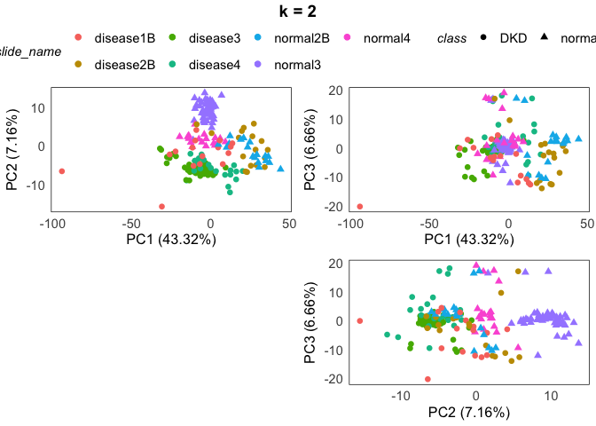<!-- --><!-- --><!-- --><!-- -->

``` r
spe_ruv4 <- geomxBatchCorrection(spe, factors = "class", 
                   NCGs = metadata(spe)$NCGs, k = 1)

plotPairPCA(spe_ruv4, assay = 2, n_dimension = 3, color =class, title = 'RUV4, k = 1')
```

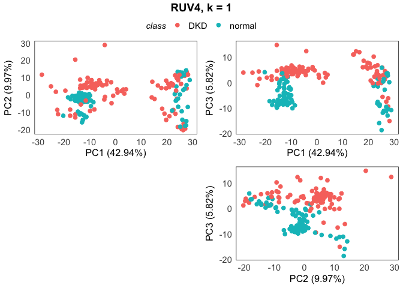<!-- -->

``` r
plotRLExpr(spe_ruv4, assay = 2, color = slide_name) + ggtitle("RUV4")
```

<!-- -->

### `limma` method

``` r
spe_lrb <- geomxBatchCorrection(spe,
                       batch = colData(spe)$slide_name, method = "Limma",
                       design = model.matrix(~class, data = colData(spe)))
```

    ## Coefficients not estimable: batch6

    ## Warning: Partial NA coefficients for 10027 probe(s)

``` r
plotPairPCA(spe_lrb, assay = 2, color = class, title = "Limma removeBatch")
```

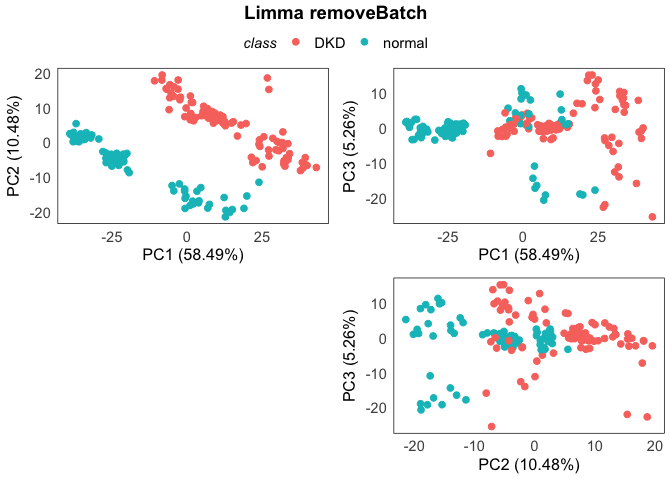<!-- -->

``` r
plotPairPCA(spe_lrb, assay = 2, color = segment, title = "Limma removeBatch")
```

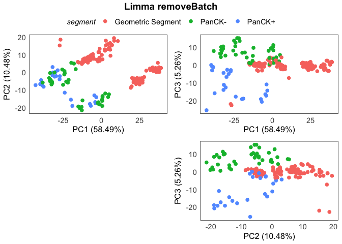<!-- -->

``` r
plotRLExpr(spe_lrb, assay = 2, color = slide_name) + ggtitle("limma removeBatch")
```

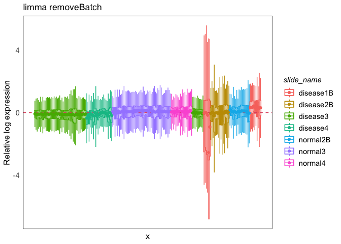<!-- -->

## Batch correction: Evaluation

To test which method might have done a better job, we can use the
`plotClusterEvalStats` function. This function computes the multiple
metrics for each method and plots them.

We focus on two types of variables: The ones related to the biology we
care, including or main variable of interest and the batch variable.

In the various test, we aim to have the highest scores for the biology,
and the lowest for the batch variable. In this case, we chose the limma
method, as it seems to have the best separation of the classes.

``` r
plotClusterEvalStats(spe_list = list(spe, spe_q3, spe_ruv4, spe_lrb),
                     bio_feature_name = "class",
                     batch_feature_name = "slide_name",
                     data_names = c("Raw", "Q3norm", "RUV4","Limma"))
```

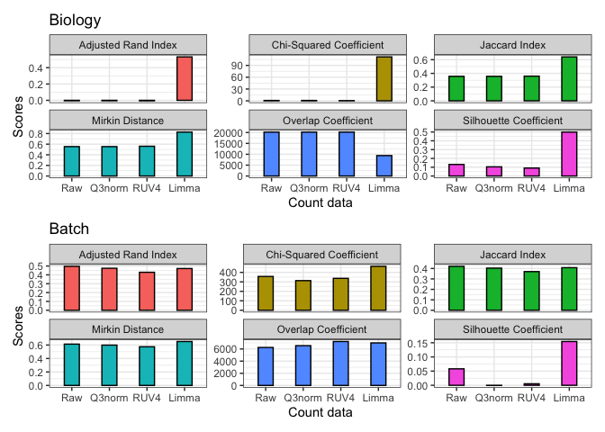<!-- -->

## DE analysis: `limma-voom`

DE analysis performed using the `limma` package. edgeR, limma-voom and
DESeq2 are recommended for GeoMx data.

Strong preference for `limma-voom` using duplicate correlation, as it is
the most robust method for this type of data. Does not modify the
variation in the dataset and assumes a mixed effect for the batch
variable.

DESeq2 is recommended when you have raw counts, and you want to include
batch variables as covariates but you also have a full-rank matrix
(Slide is not confounded with the variable of interest).

### Batch correction within DE analysis

In this case, we will start from the original dataset, since we will use
the duplicated correlation to account for the batch effect.

**Design Model**: ~ Class + Class:Cell Type

``` r
## DGEList
dge <- SE2DGEList(spe)
dge <- calcNormFactors(dge, method = 'upperquartile')
metadata <- colData(spe) %>% as.data.frame()
metadata <- mutate(metadata, 
       CellType = case_when(segment == 'Geometric Segment' ~ 'glomeruli', segment == 'PanCK-' ~ 'DistalTubules', TRUE ~ 'ProximalTubules') %>% factor(levels = c('glomeruli', 'ProximalTubules', 'DistalTubules')), 
       class = factor(class, levels = c('normal', 'DKD'))
       )
block_var = metadata$slide_name
## Create a nice variable for cell type: 

## Design model. 
design = model.matrix(~0 + CellType + class:CellType, data = metadata)
## Update contrasts names. 
colnames(design) <- gsub("CellType|class", "", colnames(design)) %>% gsub(pattern = ':', rep = '_')
```

#### Biological Coefficient of Variation

``` r
keep <- filterByExpr(dge, design)
dge_all <- dge[keep, ]
dge_all <- estimateDisp(dge_all, design = design, robust = TRUE)

plotBCV(dge_all, ylim = c(0, 1.3))
bcv_df <- data.frame(
  'BCV' = sqrt(dge_all$tagwise.dispersion),
  'AveLogCPM' = dge_all$AveLogCPM,
  'gene_id' = rownames(dge_all)
)

highbcv <- bcv_df$BCV > 0.8
highbcv_df <- bcv_df[highbcv, ]
points(highbcv_df$AveLogCPM, highbcv_df$BCV, col = "red")
text(highbcv_df$AveLogCPM, highbcv_df$BCV, labels = highbcv_df$gene_id, pos = 4)
```

<!-- -->

#### Fit model

``` r
# Estimate correlation within slides
corfit <- duplicateCorrelation(voom(dge, design), block = block_var)

# Run voom with duplicate correlation
v <- voom(dge, design, block = block_var, correlation = corfit$consensus, plot = T)
```

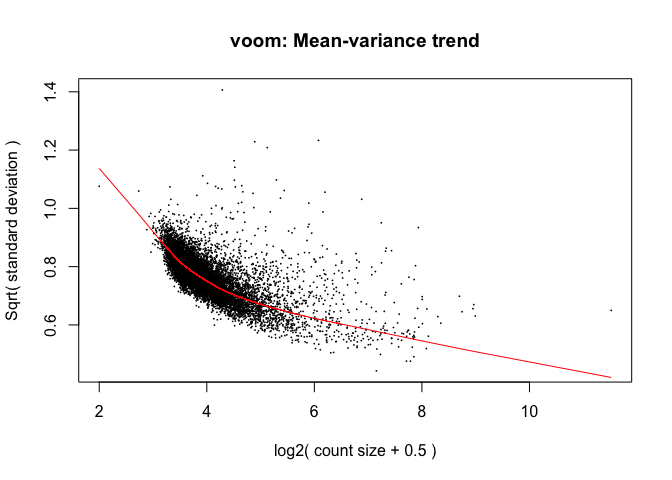<!-- -->

``` r
# Fit the model
fit <- lmFit(v, design, block = block_var, correlation = corfit$consensus)
fit <- eBayes(fit)
```

We also check the value of the concensus correlation, part of the output
of the `duplicateCorrelation` function.

If the value is \< 0.1, blocking might not as needed. If the value is
\>0.5, you might need a second round of duplicateCorrelation, same code,
but using the residuals of the first model.

In this case, `corfit$consensus.correlation` is 0.205, so the batch
seems to have an observable effect.

``` r
# Extract results for a specific class effect within a cell type.
colnames( fit$coefficients )
```

    ## [1] "glomeruli"           "ProximalTubules"     "DistalTubules"      
    ## [4] "glomeruli_DKD"       "ProximalTubules_DKD" "DistalTubules_DKD"

#### Results

``` r
for(i in c('glomeruli', 'ProximalTubules', 'DistalTubules')){
  ## Extract all the results per gene: No filter for p-value nor logFC, with regular adjustment.
  de <- topTable(fit, coef=paste0(i,"_DKD"), number=Inf) 
  
  ## DEG
  filter(de, adj.P.Val < 0.05 & abs(logFC) >= log2(1.5)) %>% 
    dplyr::select(Gene = SystematicName, mean_expr, logFC, P.Value, adj.P.Val) %>% 
    arrange(desc(abs(logFC))) %>% head(n = 20) %>% 
    knitr::kable(caption = paste0('Top 20 DEGs\nDKD vs Normal, ', i)) %>% print
  
  ## Volcano plot
  A = de %>% mutate(sig = adj.P.Val < 0.05 & abs(logFC) >= log2(1.5), gene = ifelse(sig == T, SystematicName, '')) %>% 
    ggplot(aes(x = logFC, y = -log10(adj.P.Val), color = sig, label = gene)) + theme_bw() +
    geom_hline(yintercept = 1.3, color = 'orange', linetype = 'dashed') + 
    geom_vline(xintercept = c(-0.59, 0.59),  color = 'grey50', linetype = 'dashed') +
    geom_point(size = 
                 0.5) + geom_text_repel(size = 3, color = 'black', max.overlaps = 15) + 
    scale_color_manual(values = c(`FALSE` = 'black', `TRUE` = 'red3')) +
    theme(legend.position = 'none') + ggtitle(paste('DKD vs Normal', i))
  
  print(A)
  ## Write output.
  write_tsv(de, file = paste0(out_dir, '/DEG_limmaDup_', i, '.tsv'))
}
```

    ## 
    ## 
    ## Table: Top 20 DEGs
    ## DKD vs Normal, glomeruli
    ## 
    ## |        |Gene                                            | mean_expr|     logFC|   P.Value| adj.P.Val|
    ## |:-------|:-----------------------------------------------|---------:|---------:|---------:|---------:|
    ## |TSPY1   |TSPY10, TSPY8, TSPY4, TSPY3, TSPY2, TSPY1       |  5.546339|  1.707875| 0.0000002| 0.0000373|
    ## |SUPT7L  |SUPT7L                                          | 10.076609| -1.527528| 0.0000000| 0.0000001|
    ## |IL1RL1  |IL1RL1                                          |  8.155535| -1.483940| 0.0000090| 0.0009136|
    ## |NELL1   |NELL1                                           |  5.509112|  1.474453| 0.0000013| 0.0002017|
    ## |DEFA1B  |DEFA3, DEFA1B, DEFA1                            |  6.500641|  1.450277| 0.0006756| 0.0230417|
    ## |CDKN1C  |CDKN1C                                          |  8.601450| -1.415550| 0.0000000| 0.0000000|
    ## |SLC2A3  |SLC2A3                                          |  7.491101|  1.376680| 0.0000002| 0.0000406|
    ## |NDNF    |NDNF                                            |  8.166325| -1.331612| 0.0000000| 0.0000000|
    ## |RBMY1J  |RBMY1J, RBMY1B, RBMY1F, RBMY1E, RBMY1D, RBMY1A1 |  5.616092|  1.322467| 0.0000003| 0.0000523|
    ## |RPS4Y1  |RPS4Y1                                          |  6.475183|  1.310781| 0.0001128| 0.0065383|
    ## |PCOLCE2 |PCOLCE2                                         |  6.753832| -1.273198| 0.0000000| 0.0000000|
    ## |PRY     |PRY2, PRY                                       |  5.463321|  1.256143| 0.0000804| 0.0049451|
    ## |INMT    |INMT                                            |  7.168020| -1.252936| 0.0000001| 0.0000320|
    ## |DCN     |DCN                                             |  8.457615| -1.230944| 0.0000001| 0.0000275|
    ## |ESM1    |ESM1                                            |  6.480428| -1.194444| 0.0000100| 0.0009685|
    ## |MME     |MME                                             |  9.021403| -1.190241| 0.0000000| 0.0000005|
    ## |EPAS1   |EPAS1                                           |  8.759262| -1.181429| 0.0000000| 0.0000050|
    ## |S100A9  |S100A9                                          |  7.682406|  1.179474| 0.0017409| 0.0446458|
    ## |HIPK2   |HIPK2                                           |  7.570696| -1.171178| 0.0000000| 0.0000000|
    ## |S100A8  |S100A8                                          |  6.952899|  1.152215| 0.0004519| 0.0176313|

    ## Warning: ggrepel: 219 unlabeled data points (too many overlaps). Consider
    ## increasing max.overlaps

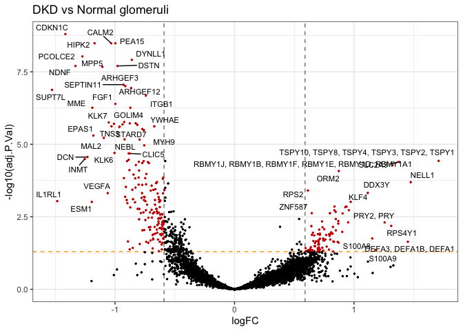<!-- -->

    ## 
    ## 
    ## Table: Top 20 DEGs
    ## DKD vs Normal, ProximalTubules
    ## 
    ## |        |Gene                                      | mean_expr|     logFC|  P.Value| adj.P.Val|
    ## |:-------|:-----------------------------------------|---------:|---------:|--------:|---------:|
    ## |AQP2    |AQP2                                      |  6.097682| -3.758518| 0.00e+00| 0.0000000|
    ## |AQP3    |AQP3                                      |  6.428913| -3.131914| 0.00e+00| 0.0000000|
    ## |C3      |C3                                        |  7.147430|  2.810847| 1.00e-07| 0.0000106|
    ## |LTF     |LTF                                       |  7.115970|  2.754074| 7.00e-07| 0.0000858|
    ## |LCN2    |LCN2                                      |  5.141235|  2.440866| 6.36e-05| 0.0027297|
    ## |HMGCS2  |HMGCS2                                    |  5.600577| -2.428644| 0.00e+00| 0.0000000|
    ## |FXYD4   |FXYD4                                     |  5.691906| -2.340825| 0.00e+00| 0.0000000|
    ## |C4B     |LOC110384692, C4A, C4B, C4B_2             |  7.382281|  2.308753| 0.00e+00| 0.0000022|
    ## |TSPY1   |TSPY10, TSPY8, TSPY4, TSPY3, TSPY2, TSPY1 |  5.546339|  2.180928| 4.00e-07| 0.0000475|
    ## |RPS4Y1  |RPS4Y1                                    |  6.475183|  2.178554| 2.00e-07| 0.0000252|
    ## |CALB1   |CALB1                                     |  5.836351| -2.161744| 0.00e+00| 0.0000000|
    ## |CAMK2N1 |CAMK2N1                                   |  4.543142| -2.121503| 0.00e+00| 0.0000001|
    ## |HSD11B2 |HSD11B2                                   |  6.619172| -2.090524| 0.00e+00| 0.0000000|
    ## |KCNJ1   |KCNJ1                                     |  5.892809| -2.083713| 0.00e+00| 0.0000000|
    ## |ID1     |ID1                                       |  7.840749| -2.004622| 0.00e+00| 0.0000077|
    ## |NDRG1   |NDRG1                                     |  8.447247| -1.994377| 0.00e+00| 0.0000000|
    ## |ANXA1   |ANXA1                                     |  7.675140|  1.805602| 4.00e-07| 0.0000508|
    ## |MDK     |MDK                                       |  5.807995|  1.795373| 5.00e-07| 0.0000586|
    ## |CTSH    |CTSH                                      |  6.452557| -1.771071| 0.00e+00| 0.0000012|
    ## |SCNN1B  |SCNN1B                                    |  5.709037| -1.749882| 0.00e+00| 0.0000000|

    ## Warning: ggrepel: 907 unlabeled data points (too many overlaps). Consider
    ## increasing max.overlaps

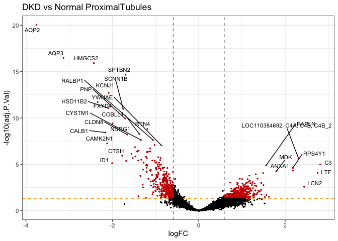<!-- -->

    ## 
    ## 
    ## Table: Top 20 DEGs
    ## DKD vs Normal, DistalTubules
    ## 
    ## |         |Gene     | mean_expr|     logFC|  P.Value| adj.P.Val|
    ## |:--------|:--------|---------:|---------:|--------:|---------:|
    ## |UMOD     |UMOD     |  7.123756| -4.562220| 0.00e+00| 0.0000000|
    ## |SLC12A1  |SLC12A1  |  6.294059| -2.440259| 0.00e+00| 0.0000002|
    ## |IGHG4    |IGHG4    |  7.563955|  2.403900| 4.00e-07| 0.0000603|
    ## |LTF      |LTF      |  7.115970|  2.286996| 1.00e-07| 0.0000285|
    ## |KNG1     |KNG1     |  6.140280| -2.267829| 0.00e+00| 0.0000000|
    ## |SUPT7L   |SUPT7L   | 10.076609| -2.197078| 0.00e+00| 0.0000000|
    ## |C3       |C3       |  7.147430|  2.182988| 0.00e+00| 0.0000001|
    ## |IGHG2    |IGHG2    |  6.790099|  2.128881| 2.00e-07| 0.0000317|
    ## |IGHG3    |IGHG3    |  6.932577|  2.100980| 3.00e-07| 0.0000535|
    ## |IGHG1    |IGHG1    |  6.802624|  1.928581| 4.01e-05| 0.0025136|
    ## |IGKC     |IGKC     |  6.826821|  1.887341| 6.30e-06| 0.0006216|
    ## |ATP5MC2  |ATP5MC2  | 10.103980| -1.672708| 0.00e+00| 0.0000009|
    ## |SFRP1    |SFRP1    |  6.152797| -1.586983| 0.00e+00| 0.0000001|
    ## |SERPINA5 |SERPINA5 |  6.225728| -1.554864| 0.00e+00| 0.0000002|
    ## |MAL      |MAL      |  6.778291| -1.537678| 0.00e+00| 0.0000000|
    ## |ATP1A1   |ATP1A1   |  8.848980| -1.498505| 0.00e+00| 0.0000000|
    ## |REG1A    |REG1A    |  5.880886|  1.466627| 2.00e-07| 0.0000326|
    ## |CDH16    |CDH16    |  6.214658| -1.452924| 0.00e+00| 0.0000000|
    ## |DEFB1    |DEFB1    |  7.633676| -1.420402| 2.21e-05| 0.0016633|
    ## |LUM      |LUM      |  5.946520|  1.329806| 1.00e-07| 0.0000285|

    ## Warning: ggrepel: 227 unlabeled data points (too many overlaps). Consider
    ## increasing max.overlaps

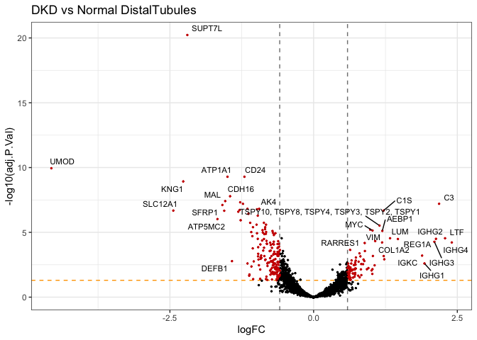<!-- -->

#### Heatmaps

For visualization, we can use one of the batch corrected datasets, in
this case, we will use the limma batch corrected dataset.

We will plot the logNorm expression in the Top 20 DEG in Glomeruli.

``` r
## Heatmaps: 
## Use the top 20 DEGs for each cell type.
i = 'glomeruli'
de <- topTable(fit, coef= paste0(i,"_DKD"), number=Inf)
  
top_20 = filter(de, adj.P.Val < 0.05 & abs(logFC) >= log2(1.5)) %>% 
    dplyr::select(Gene = SystematicName, mean_expr, logFC, P.Value, adj.P.Val) %>% 
    arrange(desc(abs(logFC))) %>% head(n = 20) %>% rownames

norm_mx = logcounts(spe_lrb)[top_20, metadata$CellType == i]

ComplexHeatmap::Heatmap(norm_mx, name = 'logNorm', 
                        #col = circlize::colorRamp2(c(0, 10, 20), c("white", "red", "darkred")), 
                        column_split = metadata$class[metadata$CellType == i],
                        cluster_rows = F, cluster_columns = F, show_row_names = T, show_column_names = F)
```

<!-- -->

### DE analysis in batch-corrected data

In this case, we will start with one of the batch corrected datasets,
since we will use the duplicated correlation to account for the batch
effect.

**Design Model**:
$`\sim Class + Class:CellType + ruvW_1 + ... + ruvW_k`$ Where $`k`$ is
the selectec coefficient for RUV4 correction.

``` r
## DGEList
dge <- SE2DGEList(spe_ruv4)
#dge <- calcNormFactors(dge, method = 'upperquartile')
metadata <- colData(spe_ruv4) %>% as.data.frame()
metadata <- mutate(metadata, 
       CellType = case_when(segment == 'Geometric Segment' ~ 'glomeruli', segment == 'PanCK-' ~ 'DistalTubules', TRUE ~ 'ProximalTubules') %>% factor(levels = c('glomeruli', 'ProximalTubules', 'DistalTubules')), 
       class = factor(class, levels = c('normal', 'DKD'))
       )

## Design model. 
design = model.matrix(~0 + CellType + class:CellType + ruv_W1, data = metadata)
## Update contrasts names. 
colnames(design) <- gsub("CellType|class", "", colnames(design)) %>% 
  gsub(pattern = ':', rep = '_')
```

``` r
## Contrast of interest.
## If interested in a specific contrast, not equal to any of the levels, create it. 
##
contr.matrix <- makeContrasts(
   Proximal_vs_DistalTubules = ProximalTubules - DistalTubules, 
   levels = colnames(design))
```

#### Biological Coefficient of Variation

``` r
keep <- filterByExpr(dge, design)
dge_all <- dge[keep, ]
dge_all <- estimateDisp(dge_all, design = design, robust = TRUE)

plotBCV(dge_all, ylim = c(0, 1.3))
bcv_df <- data.frame(
  'BCV' = sqrt(dge_all$tagwise.dispersion),
  'AveLogCPM' = dge_all$AveLogCPM,
  'gene_id' = rownames(dge_all)
)

highbcv <- bcv_df$BCV > 0.8
highbcv_df <- bcv_df[highbcv, ]
points(highbcv_df$AveLogCPM, highbcv_df$BCV, col = "red")
text(highbcv_df$AveLogCPM, highbcv_df$BCV, labels = highbcv_df$gene_id, pos = 4)
```

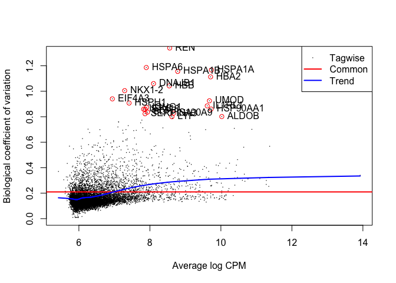<!-- -->

#### Fit model

``` r
# Run voom. 
v <- voom(dge, design, plot = T)
```

<!-- -->

``` r
# Fit the model
fit <- lmFit(v)
fit <- eBayes(fit)

## fit_contrast <- contrasts.fit(fit, contrasts = contr.matrix) -> If you have a contrast of interest
## fit_contrast <- eBayes(fit_contrast)
```

``` r
# Extract results for a specific class effect within a cell type.
colnames( fit$coefficients )
```

    ## [1] "glomeruli"           "ProximalTubules"     "DistalTubules"      
    ## [4] "ruv_W1"              "glomeruli_DKD"       "ProximalTubules_DKD"
    ## [7] "DistalTubules_DKD"

#### Results

``` r
for(i in c('glomeruli', 'ProximalTubules', 'DistalTubules')){
  de <- topTable(fit, coef=paste0(i,"_DKD"), number=Inf)
  
  ## DEG
  filter(de, adj.P.Val < 0.05 & abs(logFC) >= log2(1.5)) %>% 
    dplyr::select(Gene = SystematicName, mean_expr, logFC, P.Value, adj.P.Val) %>% 
    arrange(desc(abs(logFC))) %>% head(n = 20) %>% 
    knitr::kable(caption = paste0('Top 20 DEGs\nDKD vs Normal, ', i)) %>% print
  
  ## Volcano plot
  A = de %>% mutate(sig = adj.P.Val < 0.05 & abs(logFC) >= log2(1.5), gene = ifelse(sig == T, SystematicName, '')) %>% 
    ggplot(aes(x = logFC, y = -log10(adj.P.Val), color = sig, label = gene)) + theme_bw() +
    geom_hline(yintercept = 1.3, color = 'orange', linetype = 'dashed') + 
    geom_vline(xintercept = c(-0.59, 0.59),  color = 'grey50', linetype = 'dashed') +
    geom_point(size = 
                 0.5) + geom_text_repel(size = 3, color = 'black', max.overlaps = 15) + 
    scale_color_manual(values = c(`FALSE` = 'black', `TRUE` = 'red3')) +
    theme(legend.position = 'none') + ggtitle(paste('DKD vs Normal', i))
  
  print(A)
  
  write_tsv(de, file = paste0(out_dir, '/DEG_RUV4_', i, '.tsv'))
}
```

    ## 
    ## 
    ## Table: Top 20 DEGs
    ## DKD vs Normal, glomeruli
    ## 
    ## |       |Gene                                            | mean_expr|     logFC| P.Value| adj.P.Val|
    ## |:------|:-----------------------------------------------|---------:|---------:|-------:|---------:|
    ## |ALDOB  |ALDOB                                           |  8.432045| -2.328214|       0|     0e+00|
    ## |TSPY1  |TSPY10, TSPY8, TSPY4, TSPY3, TSPY2, TSPY1       |  5.546339|  2.179029|       0|     0e+00|
    ## |IGKC   |IGKC                                            |  6.826821|  1.952957|       0|     0e+00|
    ## |IGHG4  |IGHG4                                           |  7.563955|  1.945406|       0|     0e+00|
    ## |S100A9 |S100A9                                          |  7.682406|  1.891984|       0|     0e+00|
    ## |IGHG1  |IGHG1                                           |  6.802624|  1.836130|       0|     0e+00|
    ## |IGHG2  |IGHG2                                           |  6.790099|  1.749226|       0|     0e+00|
    ## |RPS4Y1 |RPS4Y1                                          |  6.475183|  1.734083|       0|     0e+00|
    ## |S100A8 |S100A8                                          |  6.952899|  1.638673|       0|     0e+00|
    ## |SLC2A3 |SLC2A3                                          |  7.491101|  1.591278|       0|     0e+00|
    ## |RBMY1J |RBMY1J, RBMY1B, RBMY1F, RBMY1E, RBMY1D, RBMY1A1 |  5.616092|  1.579038|       0|     0e+00|
    ## |PRY    |PRY2, PRY                                       |  5.463321|  1.547568|       0|     0e+00|
    ## |CDKN1C |CDKN1C                                          |  8.601450| -1.547419|       0|     0e+00|
    ## |NDNF   |NDNF                                            |  8.166325| -1.534241|       0|     0e+00|
    ## |IL1RL1 |IL1RL1                                          |  8.155535| -1.528025|       0|     0e+00|
    ## |DEFA1B |DEFA3, DEFA1B, DEFA1                            |  6.500641|  1.481207|       0|     0e+00|
    ## |GATM   |GATM                                            |  6.856307| -1.452281|       0|     0e+00|
    ## |DCN    |DCN                                             |  8.457615| -1.444185|       0|     0e+00|
    ## |IGHG3  |IGHG3                                           |  6.932577|  1.439283|       0|     1e-07|
    ## |SOST   |SOST                                            |  6.889427| -1.429689|       0|     0e+00|

    ## Warning: ggrepel: 470 unlabeled data points (too many overlaps). Consider
    ## increasing max.overlaps

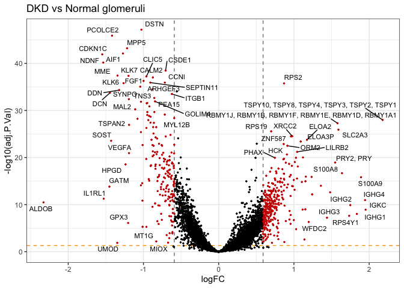<!-- -->

    ## 
    ## 
    ## Table: Top 20 DEGs
    ## DKD vs Normal, ProximalTubules
    ## 
    ## |         |Gene                                      | mean_expr|     logFC| P.Value| adj.P.Val|
    ## |:--------|:-----------------------------------------|---------:|---------:|-------:|---------:|
    ## |AQP2     |AQP2                                      |  6.097682| -3.578242| 0.0e+00| 0.0000000|
    ## |LCN2     |LCN2                                      |  5.141235|  3.057001| 0.0e+00| 0.0000012|
    ## |LTF      |LTF                                       |  7.115970|  3.031359| 0.0e+00| 0.0000010|
    ## |C3       |C3                                        |  7.147430|  2.888423| 0.0e+00| 0.0000001|
    ## |AQP3     |AQP3                                      |  6.428913| -2.684741| 0.0e+00| 0.0000000|
    ## |RPS4Y1   |RPS4Y1                                    |  6.475183|  2.642604| 3.0e-06| 0.0001309|
    ## |FXYD4    |FXYD4                                     |  5.691906| -2.568854| 0.0e+00| 0.0000000|
    ## |HMGCS2   |HMGCS2                                    |  5.600577| -2.455974| 0.0e+00| 0.0000000|
    ## |C4B      |LOC110384692, C4A, C4B, C4B_2             |  7.382281|  2.412786| 0.0e+00| 0.0000000|
    ## |SERPINA3 |SERPINA3                                  |  6.576983|  2.318506| 1.7e-05| 0.0005431|
    ## |TSPY1    |TSPY10, TSPY8, TSPY4, TSPY3, TSPY2, TSPY1 |  5.546339|  2.192733| 0.0e+00| 0.0000018|
    ## |CALB1    |CALB1                                     |  5.836351| -2.112721| 0.0e+00| 0.0000000|
    ## |HSD11B2  |HSD11B2                                   |  6.619172| -2.076612| 0.0e+00| 0.0000000|
    ## |ID1      |ID1                                       |  7.840749| -2.006961| 0.0e+00| 0.0000000|
    ## |SPP1     |SPP1                                      |  9.127455|  1.943957| 4.3e-06| 0.0001762|
    ## |KCNJ1    |KCNJ1                                     |  5.892809| -1.942867| 0.0e+00| 0.0000000|
    ## |ANXA1    |ANXA1                                     |  7.675140|  1.926145| 0.0e+00| 0.0000000|
    ## |NDRG1    |NDRG1                                     |  8.447247| -1.853441| 0.0e+00| 0.0000000|
    ## |DDX3Y    |DDX3Y                                     |  5.917269|  1.852185| 7.0e-07| 0.0000426|
    ## |SCNN1B   |SCNN1B                                    |  5.709037| -1.783067| 0.0e+00| 0.0000000|

    ## Warning: ggrepel: 899 unlabeled data points (too many overlaps). Consider
    ## increasing max.overlaps

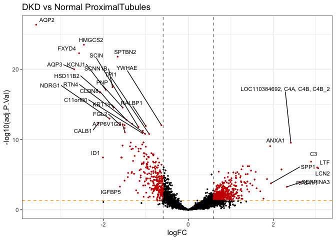<!-- -->

    ## 
    ## 
    ## Table: Top 20 DEGs
    ## DKD vs Normal, DistalTubules
    ## 
    ## |         |Gene     | mean_expr|     logFC| P.Value| adj.P.Val|
    ## |:--------|:--------|---------:|---------:|-------:|---------:|
    ## |UMOD     |UMOD     |  7.123756| -4.487592|       0|     0e+00|
    ## |IGHG4    |IGHG4    |  7.563955|  2.624678|       0|     0e+00|
    ## |SLC12A1  |SLC12A1  |  6.294059| -2.433786|       0|     0e+00|
    ## |LTF      |LTF      |  7.115970|  2.432198|       0|     0e+00|
    ## |IGHG1    |IGHG1    |  6.802624|  2.352698|       0|     0e+00|
    ## |IGHG2    |IGHG2    |  6.790099|  2.286712|       0|     0e+00|
    ## |IGHG3    |IGHG3    |  6.932577|  2.273418|       0|     0e+00|
    ## |SUPT7L   |SUPT7L   | 10.076609| -2.186201|       0|     0e+00|
    ## |IGKC     |IGKC     |  6.826821|  2.144474|       0|     0e+00|
    ## |KNG1     |KNG1     |  6.140280| -2.100067|       0|     0e+00|
    ## |C3       |C3       |  7.147430|  2.040560|       0|     0e+00|
    ## |SERPINA1 |SERPINA1 |  8.130110| -1.713682|       0|     0e+00|
    ## |REG1A    |REG1A    |  5.880886|  1.545211|       0|     0e+00|
    ## |SERPINA5 |SERPINA5 |  6.225728| -1.536060|       0|     0e+00|
    ## |MAL      |MAL      |  6.778291| -1.458597|       0|     0e+00|
    ## |ATP5MC2  |ATP5MC2  | 10.103980| -1.455902|       0|     6e-07|
    ## |SFRP1    |SFRP1    |  6.152797| -1.427402|       0|     0e+00|
    ## |ATP1A1   |ATP1A1   |  8.848980| -1.419937|       0|     0e+00|
    ## |LUM      |LUM      |  5.946520|  1.406114|       0|     0e+00|
    ## |COL1A2   |COL1A2   |  7.368705|  1.331767|       0|     0e+00|

    ## Warning: ggrepel: 253 unlabeled data points (too many overlaps). Consider
    ## increasing max.overlaps

<!-- -->

#### Heatmaps

For visualization, we use the batch corrected datasets, in this case, we
will use the RUV4 batch corrected dataset.

We will plot the logNorm expression in the Top 20 DEG in Glomeruli.

``` r
## Heatmaps: 
## Use the top 20 DEGs for each cell type.
i = 'glomeruli'
de <- topTable(fit, coef= paste0(i,"_DKD"), number=Inf)
  
top_20 = filter(de, adj.P.Val < 0.05 & abs(logFC) >= log2(1.5)) %>% 
    dplyr::select(Gene = SystematicName, mean_expr, logFC, P.Value, adj.P.Val) %>% 
    arrange(desc(abs(logFC))) %>% head(n = 20) %>% rownames

norm_mx = logcounts(spe_ruv4)[top_20, metadata$CellType == i]

ComplexHeatmap::Heatmap(norm_mx, name = 'logNorm', 
                        #col = circlize::colorRamp2(c(0, 10, 20), c("white", "red", "darkred")), 
                        column_split = metadata$class[metadata$CellType == i],
                        cluster_rows = F, cluster_columns = F, show_row_names = T, show_column_names = F)
```

    ## Warning: The input is a data frame-like object, convert it to a matrix.

<!-- -->

## R Session

``` r
## Session info
map(sessionInfo()$otherPkgs, ~.x$Version)
```

    ## $ggalluvial
    ## [1] "0.12.5"
    ## 
    ## $edgeR
    ## [1] "4.4.0"
    ## 
    ## $limma
    ## [1] "3.62.1"
    ## 
    ## $SpatialExperiment
    ## [1] "1.16.0"
    ## 
    ## $SingleCellExperiment
    ## [1] "1.28.0"
    ## 
    ## $SummarizedExperiment
    ## [1] "1.36.0"
    ## 
    ## $GenomicRanges
    ## [1] "1.58.0"
    ## 
    ## $GenomeInfoDb
    ## [1] "1.42.3"
    ## 
    ## $IRanges
    ## [1] "2.40.1"
    ## 
    ## $MatrixGenerics
    ## [1] "1.18.0"
    ## 
    ## $matrixStats
    ## [1] "1.5.0"
    ## 
    ## $standR
    ## [1] "1.10.0"
    ## 
    ## $SpatialDecon
    ## [1] "1.16.0"
    ## 
    ## $PCAtools
    ## [1] "2.18.0"
    ## 
    ## $ggrepel
    ## [1] "0.9.6"
    ## 
    ## $ComplexHeatmap
    ## [1] "2.22.0"
    ## 
    ## $umap
    ## [1] "0.2.10.0"
    ## 
    ## $GeomxTools
    ## [1] "3.10.0"
    ## 
    ## $NanoStringNCTools
    ## [1] "1.14.0"
    ## 
    ## $S4Vectors
    ## [1] "0.44.0"
    ## 
    ## $Biobase
    ## [1] "2.66.0"
    ## 
    ## $BiocGenerics
    ## [1] "0.52.0"
    ## 
    ## $lubridate
    ## [1] "1.9.4"
    ## 
    ## $forcats
    ## [1] "1.0.0"
    ## 
    ## $stringr
    ## [1] "1.5.1"
    ## 
    ## $dplyr
    ## [1] "1.1.4"
    ## 
    ## $purrr
    ## [1] "1.0.4"
    ## 
    ## $readr
    ## [1] "2.1.5"
    ## 
    ## $tidyr
    ## [1] "1.3.1"
    ## 
    ## $tibble
    ## [1] "3.2.1"
    ## 
    ## $ggplot2
    ## [1] "3.5.1"
    ## 
    ## $tidyverse
    ## [1] "2.0.0"
