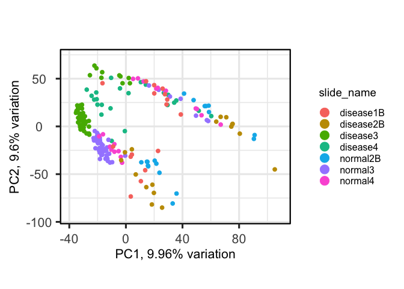
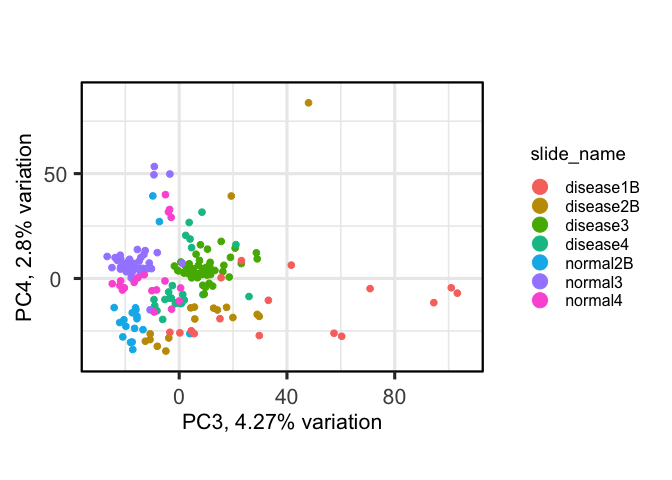
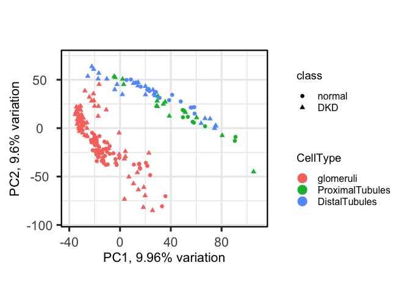
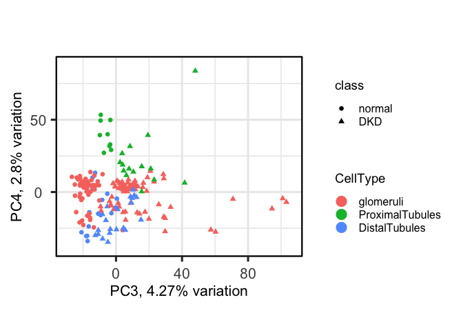
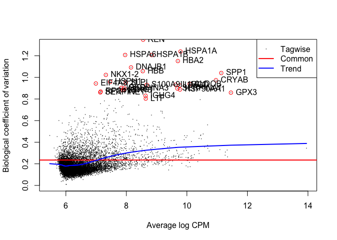
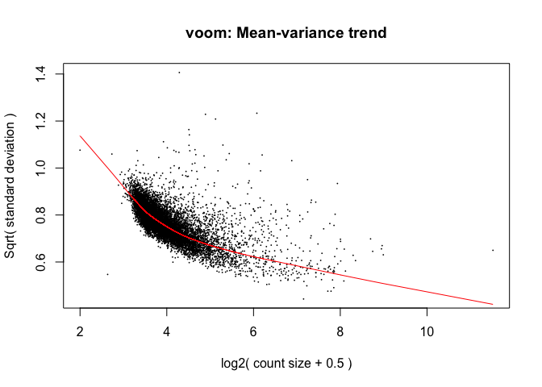
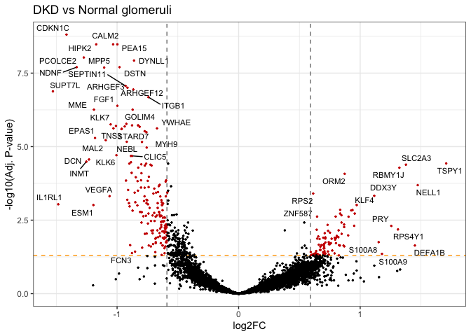
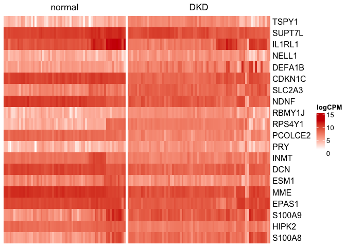
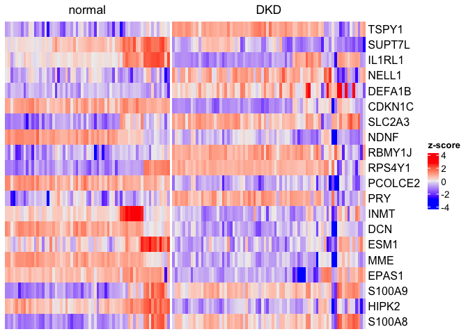

# DE analysis using limma: Normalization, Batch correction and DE analysis
### Author: Diana Vera Cruz
### Date: 04/02/2025

## Goal

Perform normalization and DE analysis using the limma package. We
recommend to use the `limma-voom` method for DE analysis, as it is the
most robust method for this type of data, coupled with the
`duplicateCorrelation` function to account for the batch effect.

## DE question

**For a given cell type, do we see differences between the normal and
DKD segments?**

## Input Data

We will use the tables generated in the previous QC step, they are found
in the results folder.

- **Counts**: Dataframe, or table, including a column with the gene name
  (Default, `TargetName`).

- **Sample Annotation**: Sample annotation, it should include a segment
  name column, (Default, `SegmentDisplayName`) and Coordinate columns
  (Default, `ROICoordinateX` and `ROICoordinateY`).

``` r
counts = read_tsv('../results/tidy_counts.tsv') %>% column_to_rownames('TargetName') %>% as.matrix()

## Metadata: Format and ensure that the variables of interest are factors, and in the desired order.
metadata = read_tsv('../results/tidy_metadata.tsv') %>% as.data.frame()
rownames(metadata) = metadata$segment_name
metadata <- mutate(metadata, 
       CellType = case_when(segment == 'Geometric Segment' ~ 'glomeruli', segment == 'PanCK-' ~ 'DistalTubules', TRUE ~ 'ProximalTubules') %>% factor(levels = c('glomeruli', 'ProximalTubules', 'DistalTubules')), 
       class = factor(class, levels = c('normal', 'DKD'))
       )

str(metadata)
```

    ## 'data.frame':    201 obs. of  13 variables:
    ##  $ segment_name    : chr  "DSP-1001250007851-H-A02.dcc" "DSP-1001250007851-H-A03.dcc" "DSP-1001250007851-H-A04.dcc" "DSP-1001250007851-H-A05.dcc" ...
    ##  $ slide_name      : chr  "disease3" "disease3" "disease3" "disease3" ...
    ##  $ region          : chr  "glomerulus" "glomerulus" "glomerulus" "glomerulus" ...
    ##  $ segment         : chr  "Geometric Segment" "Geometric Segment" "Geometric Segment" "Geometric Segment" ...
    ##  $ class           : Factor w/ 2 levels "normal","DKD": 2 2 2 2 2 2 2 2 2 2 ...
    ##  $ aoi             : chr  "Geometric Segment-aoi-001" "Geometric Segment-aoi-001" "Geometric Segment-aoi-001" "Geometric Segment-aoi-001" ...
    ##  $ roi             : num  7 8 9 10 11 12 13 14 15 16 ...
    ##  $ area            : num  31798 16920 14312 20033 27583 ...
    ##  $ nuclei          : num  225 132 114 89 132 169 105 55 164 92 ...
    ##  $ pathology       : chr  "abnormal" "abnormal" "abnormal" "abnormal" ...
    ##  $ ROI_Coordinate_X: num  89.1 237.7 174 184.3 374.3 ...
    ##  $ ROI_Coordinate_Y: num  108.4 124.2 167.8 69.4 177.3 ...
    ##  $ CellType        : Factor w/ 3 levels "glomeruli","ProximalTubules",..: 1 1 1 1 1 1 1 1 1 1 ...

## Dataset exploration

``` r
dplyr::count(metadata, slide_name, CellType, segment, region, class)
```

    ##    slide_name        CellType           segment     region  class  n
    ## 1   disease1B       glomeruli Geometric Segment glomerulus    DKD  8
    ## 2   disease1B ProximalTubules            PanCK+     tubule    DKD  3
    ## 3   disease1B   DistalTubules            PanCK-     tubule    DKD  5
    ## 4   disease2B       glomeruli Geometric Segment glomerulus    DKD  9
    ## 5   disease2B ProximalTubules            PanCK+     tubule    DKD  2
    ## 6   disease2B   DistalTubules            PanCK-     tubule    DKD  6
    ## 7    disease3       glomeruli Geometric Segment glomerulus    DKD 46
    ## 8    disease3 ProximalTubules            PanCK+     tubule    DKD  4
    ## 9    disease3   DistalTubules            PanCK-     tubule    DKD  6
    ## 10   disease4       glomeruli Geometric Segment glomerulus    DKD 11
    ## 11   disease4 ProximalTubules            PanCK+     tubule    DKD  6
    ## 12   disease4   DistalTubules            PanCK-     tubule    DKD  6
    ## 13   normal2B       glomeruli Geometric Segment glomerulus normal 10
    ## 14   normal2B ProximalTubules            PanCK+     tubule normal  2
    ## 15   normal2B   DistalTubules            PanCK-     tubule normal  6
    ## 16    normal3       glomeruli Geometric Segment glomerulus normal 44
    ## 17    normal3 ProximalTubules            PanCK+     tubule normal  3
    ## 18    normal3   DistalTubules            PanCK-     tubule normal  5
    ## 19    normal4       glomeruli Geometric Segment glomerulus normal  9
    ## 20    normal4 ProximalTubules            PanCK+     tubule normal  4
    ## 21    normal4   DistalTubules            PanCK-     tubule normal  6

## Normalization

We will start with the raw counts and Compute Q3 normalization.

``` r
## DGEList: Create object from counts, metadata and main variable of interest.
dge <- DGEList(counts = counts, samples = metadata)

## Q3 normalization
dge <- calcNormFactors(dge, method = 'upperquartile')
```

To obtain $log_2CPM$ values, we will use voom, in this case we use a
simple design matrix, that captures our main variables of interest and
the batch variable.

``` r
## Initial design matrix: Include key variables that explain the variation in the study. 
design = model.matrix(~CellType + class + slide_name, data = metadata)
logcpm <- voom(dge, design)$E
```

    ## Coefficients not estimable: slide_namenormal4

    ## Warning: Partial NA coefficients for 10028 probe(s)

### PCA

We will perform a PCA analysis to explore the variation in the dataset,
using logCPM values.

``` r
pca <- pca(logcpm, meta = metadata, scale = T)

screeplot(pca, components = 1:50, axisLabSize = 12)
```

<!-- -->

``` r
biplot(pca, pointSize = 2, colby = "slide_name", lab = NULL, legendPosition = 'right')
```

<!-- -->

``` r
biplot(pca, x = 'PC3', y = 'PC4', pointSize = 2, colby = "slide_name", lab = NULL, legendPosition = 'right')
```

<!-- -->

``` r
biplot(pca, pointSize = 2, colby = "CellType", shape = "class", lab = NULL, legendPosition = 'right')
```

<!-- -->

``` r
biplot(pca, x = 'PC3', y = 'PC4', pointSize = 2, colby = "CellType", shape = "class", lab = NULL, legendPosition = 'right')
```

<!-- -->

## DE analysis: `limma-voom`

DE analysis performed using the `limma` package. edgeR, limma-voom and
DESeq2 are recommended for GeoMx data.

Strong preference for `limma-voom` using duplicate correlation, as it is
the most robust method for this type of data. Does not modify the
variation in the dataset and assumes a mixed effect for the batch
variable.

DESeq2 is recommended when you have raw counts, and you want to include
batch variables as covariates but you also have a full-rank matrix
(Slide is not confounded with the variable of interest).

In this case, we will start from the original dataset, since we will use
the duplicated correlation to account for the batch effect.

**Design Model**: ~ CellType + Class:CellType

``` r
## Block variable set to the batch variable
block_var = metadata$slide_name

## Design model. 
design = model.matrix(~0 + CellType + class:CellType, data = metadata)
## Update contrasts names. 
colnames(design) <- gsub("CellType|class", "", colnames(design)) %>% gsub(pattern = ':', rep = '_')
```

#### Biological Coefficient of Variation

``` r
keep <- filterByExpr(dge, design)
dge_all <- dge[keep, ]
dge_all <- estimateDisp(dge_all, design = design, robust = TRUE)

plotBCV(dge_all, ylim = c(0, 1.3))
bcv_df <- data.frame(
  'BCV' = sqrt(dge_all$tagwise.dispersion),
  'AveLogCPM' = dge_all$AveLogCPM,
  'gene_id' = rownames(dge_all)
)

highbcv <- bcv_df$BCV > 0.8
highbcv_df <- bcv_df[highbcv, ]
points(highbcv_df$AveLogCPM, highbcv_df$BCV, col = "red")
text(highbcv_df$AveLogCPM, highbcv_df$BCV, labels = highbcv_df$gene_id, pos = 4)
```

<!-- -->

#### Fit model

``` r
# Estimate correlation within slides
corfit <- duplicateCorrelation(voom(dge, design), block = block_var)

# Run voom with duplicate correlation
v <- voom(dge, design, block = block_var, correlation = corfit$consensus, plot = T)
```

<!-- -->

``` r
# Fit the model
fit <- lmFit(v, design, block = block_var, correlation = corfit$consensus)
fit <- eBayes(fit)
```

We also check the value of the concensus correlation, part of the output
of the `duplicateCorrelation` function.

If the value is \< 0.1, blocking might not as needed. If the value is
\>0.5, you might need a second round of duplicateCorrelation, same code,
but using the residuals of the first model.

In this case, `corfit$consensus.correlation` is **0.205**, so the batch
seems to have an observable effect.

``` r
# Extract results for a specific class effect within a cell type.
colnames( fit$coefficients )
```

    ## [1] "glomeruli"           "ProximalTubules"     "DistalTubules"       "glomeruli_DKD"       "ProximalTubules_DKD"
    ## [6] "DistalTubules_DKD"

#### Results

In this case we will focus on DE between disease and normal samples in
glomeruli, which is represented by the `glomeruli_DKD` coefficient.

``` r
this_coef = 'glomeruli_DKD'
i = 'glomeruli'

## Extract all the results per gene: No filter for p-value nor logFC, with regular adjustment.
de <- topTable(fit, coef=this_coef,  number=Inf) %>% mutate(CellType = i) %>% rownames_to_column('Gene')
  
## Show DE. 
filter(de, adj.P.Val < 0.05 & abs(logFC) >= log2(1.5)) %>% 
    dplyr::select(Gene, logFC, P.Value, adj.P.Val) %>% 
    arrange(desc(abs(logFC))) %>% head(n = 20) %>% 
    knitr::kable(caption = paste0('Top 20 DEGs\nDKD vs Normal, ', i))
```

| Gene    |     logFC |   P.Value | adj.P.Val |
|:--------|----------:|----------:|----------:|
| TSPY1   |  1.707835 | 0.0000002 | 0.0000373 |
| SUPT7L  | -1.528025 | 0.0000000 | 0.0000001 |
| IL1RL1  | -1.484195 | 0.0000090 | 0.0009137 |
| NELL1   |  1.473469 | 0.0000013 | 0.0002036 |
| DEFA1B  |  1.450012 | 0.0006777 | 0.0230282 |
| CDKN1C  | -1.416080 | 0.0000000 | 0.0000000 |
| SLC2A3  |  1.376519 | 0.0000002 | 0.0000410 |
| NDNF    | -1.332004 | 0.0000000 | 0.0000000 |
| RBMY1J  |  1.322612 | 0.0000003 | 0.0000522 |
| RPS4Y1  |  1.310669 | 0.0001131 | 0.0065576 |
| PCOLCE2 | -1.273577 | 0.0000000 | 0.0000000 |
| PRY     |  1.255908 | 0.0000807 | 0.0049619 |
| INMT    | -1.252914 | 0.0000001 | 0.0000324 |
| DCN     | -1.231292 | 0.0000001 | 0.0000274 |
| ESM1    | -1.194987 | 0.0000099 | 0.0009685 |
| MME     | -1.190490 | 0.0000000 | 0.0000006 |
| EPAS1   | -1.181506 | 0.0000000 | 0.0000051 |
| S100A9  |  1.179379 | 0.0017487 | 0.0446220 |
| HIPK2   | -1.171479 | 0.0000000 | 0.0000000 |
| S100A8  |  1.152229 | 0.0004539 | 0.0177107 |

Top 20 DEGs DKD vs Normal, glomeruli

``` r
## Volcano plot
de %>% mutate(sig = adj.P.Val < 0.05 & abs(logFC) >= log2(1.5), gene = ifelse(sig == T, Gene, '')) %>% 
    ggplot(aes(x = logFC, y = -log10(adj.P.Val), color = sig, label = gene)) + theme_bw() +
    geom_hline(yintercept = 1.3, color = 'orange', linetype = 'dashed') + 
    geom_vline(xintercept = c(-0.59, 0.59),  color = 'grey50', linetype = 'dashed') +
    geom_point(size = 0.5) + geom_text_repel(size = 3, color = 'black', max.overlaps = 15) + 
    scale_color_manual(values = c(`FALSE` = 'black', `TRUE` = 'red3')) +
    theme(legend.position = 'none') + labs(title = paste('DKD vs Normal', i), y = '-log10(Adj. P-value)', x = 'log2FC')
```

    ## Warning: ggrepel: 216 unlabeled data points (too many overlaps). Consider increasing max.overlaps

<!-- -->

#### Heatmaps

For visualization, we can use one of the batch corrected datasets, in
this case, we will use the limma batch corrected dataset.

We will plot the logNorm expression in the Top 20 DEG in Glomeruli.

``` r
## Heatmaps: Top 20 DEGs. 
top_20 = filter(de, adj.P.Val < 0.05 & abs(logFC) >= log2(1.5)) %>% 
    dplyr::select(Gene, logFC, P.Value, adj.P.Val) %>% 
    arrange(desc(abs(logFC))) %>% head(n = 20) %>% pull('Gene')

norm_mx = logcpm[top_20, metadata$CellType == i]
scale(norm_mx) -> norm_mx


ComplexHeatmap::Heatmap(logcpm[top_20, metadata$CellType == i], 
                        name = 'logCPM', col = c('white', 'red3'),
                        column_split = metadata$class[metadata$CellType == i],
                        cluster_rows = F, cluster_columns = F, show_row_names = T, show_column_names = F)
```

<!-- -->

``` r
norm_mx = logcpm[top_20, metadata$CellType == i] %>% t %>% scale()

ComplexHeatmap::Heatmap(t(norm_mx), 
                        name = 'z-score', 
                        column_split = metadata$class[metadata$CellType == i],
                        cluster_rows = F, cluster_columns = F, show_row_names = T, show_column_names = F)
```

<!-- -->

## R Session

``` r
map(sessionInfo()$otherPkgs, ~.x$Version)
```

    ## $PCAtools
    ## [1] "2.14.0"
    ## 
    ## $ggrepel
    ## [1] "0.9.6"
    ## 
    ## $ggalluvial
    ## [1] "0.12.5"
    ## 
    ## $edgeR
    ## [1] "4.0.16"
    ## 
    ## $limma
    ## [1] "3.58.1"
    ## 
    ## $lubridate
    ## [1] "1.9.4"
    ## 
    ## $forcats
    ## [1] "1.0.0"
    ## 
    ## $stringr
    ## [1] "1.5.1"
    ## 
    ## $dplyr
    ## [1] "1.1.4"
    ## 
    ## $purrr
    ## [1] "1.0.4"
    ## 
    ## $readr
    ## [1] "2.1.5"
    ## 
    ## $tidyr
    ## [1] "1.3.1"
    ## 
    ## $tibble
    ## [1] "3.2.1"
    ## 
    ## $ggplot2
    ## [1] "3.5.1"
    ## 
    ## $tidyverse
    ## [1] "2.0.0"
