# Normalization and DE analysis using `GeoMxTools`
### Author: Diana Vera Cruz
### Date: 03/31/2025

## Goals

Perform normalization and initial visualization, followed by DE
analysis.

## Requirements

This script uses the output GeoMx object from the QC script. It
continues on the remaining steps for the Kidney dataset from:
[GeoMx tutorial](https://www.bioconductor.org/packages/release/workflows/vignettes/GeoMxWorkflows/inst/doc/GeomxTools_RNA-NGS_Analysis.html

## 1. Normalization

We will calculate Q3 normalization, this method is suggested as the
initial normalization to be used with DSP-NGS RNA data, unless the data
requires more stringent normalization.

One of the key observations is the relationship between the upper
quartile (Q3) of the counts in each segment with the negative control
probes in the data, once aggregated, this You are looking for a
separation between them, with lower values for the negative control
probes. Ideally, there should be a separation between these two values
to ensure we have stable measure of Q3 signal.

``` r
library(tidyverse)
library(GeomxTools)

## Read tidy object. 
geomx <- readRDS('../env/tidy_geomx_obj.RDS')
```

``` r
# Graph Q3 value vs negGeoMean of Negatives
ann_of_interest <- "region"

## Negative probes expression: Compute Negative mean. 
neg_probes = exprs(geomx)[unique( subset(fData(geomx), CodeClass == "Negative")$TargetName ), ]
if(class(neg_probes)[1] != 'matrix') neg_probes <- matrix(neg_probes, nrow = 1) ## 1 row per probeset. 

## Statistic data: 
Stat_data <- data.frame(Segment = colnames(exprs(geomx)),
                        Annotation = pData(geomx)[, ann_of_interest],
                        Q3 = apply(exprs(geomx), 2, quantile, 0.75, na.rm = TRUE),
                        NegProbe = apply(neg_probes, 2, function(x) exp(mean(log(x)))) ## Geom Mean
                 )

ggplot(Stat_data) + theme_bw() +
  geom_histogram(aes(x = Q3, fill = 'Q3'), bins = 40) +
  geom_histogram(aes(x = NegProbe, fill = 'NegProbeGM'), bins = 40) +
  scale_fill_brewer(palette = 3, type = "qual") +
  scale_x_continuous(trans = "log2") +
  facet_wrap(~Annotation) + labs(x = "Value", y = "Segments, #")
```

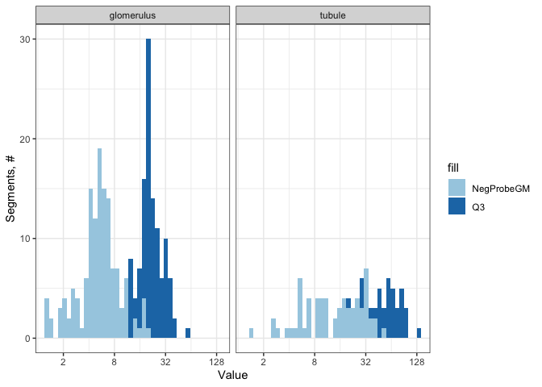<!-- -->

``` r
ggplot(Stat_data, aes(x = NegProbe, y = Q3)) +
    geom_abline(intercept = 0, slope = 1, lty = "dashed", color = "darkgray") +
    geom_point() + guides(color = "none") + theme_bw() +
    scale_x_continuous(trans = "log2") + 
    scale_y_continuous(trans = "log2") +
    theme(aspect.ratio = 1) + facet_wrap(~Annotation) +
    labs(x = "Negative Probe GeoMean, Counts", y = "Q3 Value, Counts")
```

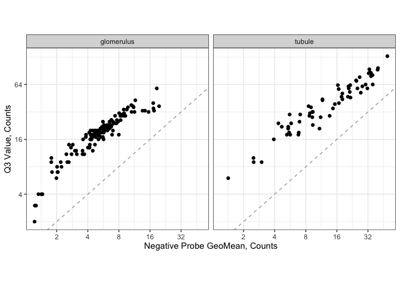<!-- -->

``` r
## normalize function: toElt can have any character string, but it should be unique.

# Q3 norm (75th percentile) for WTA/CTA  with or without custom spike-ins
geomx <- normalize(geomx,
                   norm_method = "quant", 
                   desiredQuantile = .75,
                   toElt = "q_norm")

# Background normalization for WTA/CTA without custom spike-in, norm_method = 'neg'.
geomx <- normalize(geomx ,
                   norm_method = "neg", 
                   fromElt = "exprs",
                   toElt = "neg_norm")

## Store a log2 transformation for Q3 norm. 
assayDataElement(object = geomx, elt = "log_q") <-
    assayDataApply(geomx, 2, FUN = log, base = 2, elt = "q_norm") 
```

``` r
boxplot(exprs(geomx), 
        col = "skyblue", main = "Raw Counts",
        log = "y", names = NULL, xlab = "Segment",
        ylab = "Counts, Raw")
```

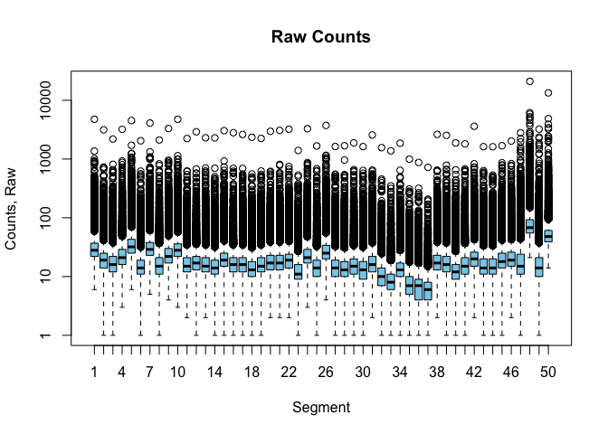<!-- -->

``` r
boxplot(assayDataElement(geomx, elt = 'q_norm'), 
        col = "green4", main = "Q3 normalization",
        log = "y", names = NULL, xlab = "Segment",
        ylab = "Q3")
```

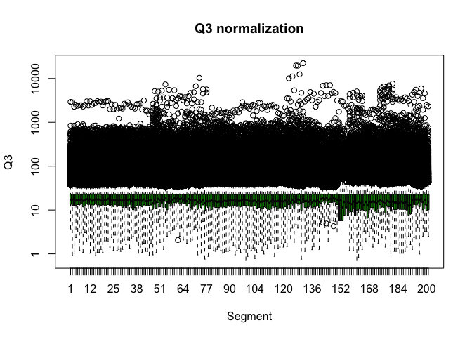<!-- -->

``` r
boxplot(assayDataElement(geomx, elt = 'neg_norm'), 
        col = "purple", main = "Background, neg normalization",
        log = "y", names = NULL, xlab = "Segment",
        ylab = "NegNorm")
```

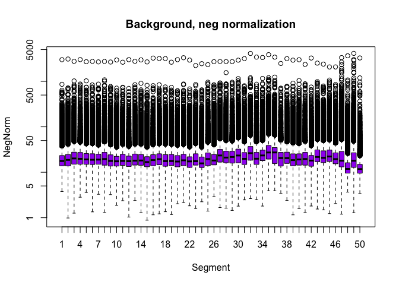<!-- -->

## Dimension reduction and clustering

To understand the variation in the data, biological signal and also
potential batch effects, we will perform PCA, UMAP

### PCA

``` r
library(PCAtools)

pc = pca(assayDataElement(geomx, elt = "log_q"), scale = F, metadata = pData(geomx)) 

screeplot(pc, components=1:50)
```

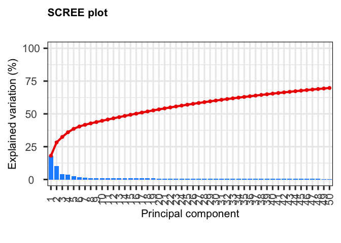<!-- -->

``` r
biplot(pc, lab = NULL, colby = "region", shape = "class", legendPosition = 'right')
```

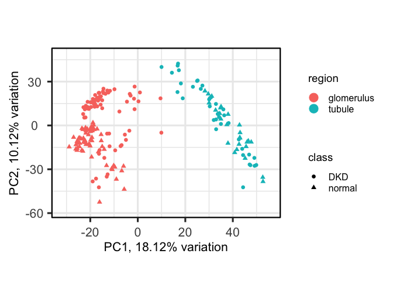<!-- -->

``` r
biplot(pc, lab = NULL, x = 'PC3',  y = 'PC4', colby = "region", shape = "class", legendPosition = 'right')
```

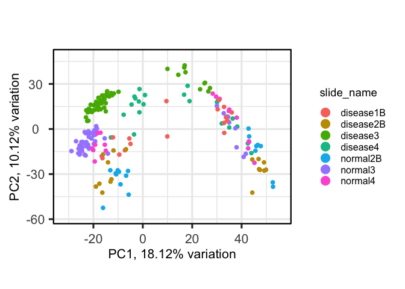<!-- -->

### UMAP

We can also use tSNE, but in this instance we will use UMAP.

We can observe that variation is highly driven by the region of
interest, and class. But there is still some clustering by slide.

``` r
library(umap)

# run UMAP: log2 Q3 normalized data
umap_out <- umap(t( assayDataElement(geomx , elt = "q_norm") ))
```

    ## Found more than one class "dist" in cache; using the first, from namespace 'BiocGenerics'

    ## Also defined by 'spam'

``` r
#> Found more than one class "dist" in cache; using the first, from namespace 'BiocGenerics'
#> Also defined by 'spam'
#
pData(geomx)[, c("UMAP1", "UMAP2")] <- umap_out$layout[, c(1,2)]

ggplot(pData(geomx), aes(x = UMAP1, y = UMAP2, color = region, shape = class)) +
    geom_point(size = 2) + theme_bw()
```

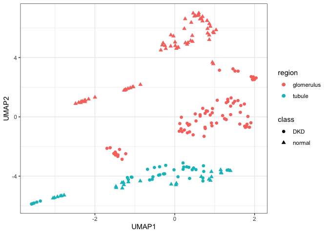<!-- -->

``` r
ggplot(pData(geomx), aes(x = UMAP1, y = UMAP2, color = slide_name)) +
    geom_point(size = 2) + theme_bw()
```

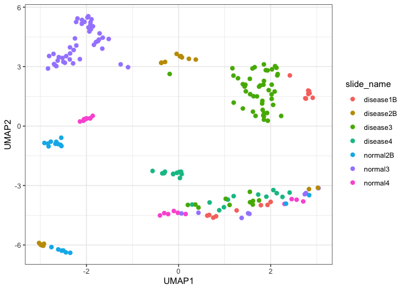<!-- -->

### Clustering high CV genes

``` r
library(ComplexHeatmap)

## Calculate CV
calc_CV <- function(x) {sd(x) / mean(x)}
CV_dat <- assayDataApply(geomx, elt = "log_q", MARGIN = 1, calc_CV)
GOI <- names(CV_dat)[CV_dat > quantile(CV_dat, 0.9)] ## Keep the top 10% Genes with highest CV. 

## Heatmap
Heatmap(assayDataElement(geomx[GOI, ], elt = "log_q"), name = 'log(Q3)', col = c('purple3','yellow2'),
        show_column_names = F, show_column_dend = F, show_row_names = F, show_row_dend = F, 
        top_annotation = HeatmapAnnotation(df = pData(geomx)[, c("class", "segment", "region")] )
        )
```

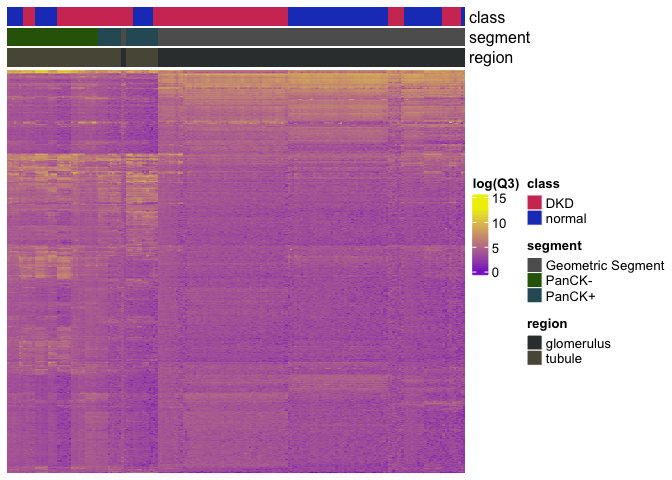<!-- -->

``` r
# If function produces an error, sometimes it's because of a big matrix, try the following. 
##  heatmap(assayDataElement(geomx[GOI, ], elt = "log_q")) If length 
```

## DE analysis

Within the `GeMxTools` package, DE analysis is done using a linear
mixed-effect model, using the `lmerTest` package. This is prefered since
we have multiple segments within the same slide or tissue sample, which
are not independent from each other. This analysis is performed in
log-normalized data.

Model:
$`log_2(gene) \sim InterestVariable\ +\ (1 + InterestVariable|Slide)`$

within the **(1 + InterestVariable\|Slide)** term, the random slope,
terms prior to the **\|**, is used to account for the fact that the
effect of the variable of interest may vary between slides, and the
random intercept (After the **\|**) accounts for the fact that the
overall expression level of the gene may vary between slides.

Two versions:

1.  Random slope: When comparing segments that co-exist in the tissue
    section. (Different cell types or regions)

2.  Without random slope: When comparing segments that are independent
    from each other. (Different slides)

### Glomerulus versus Tubules

``` r
# Convert test variables to factors: Variable of interest and other variables to control for. 
pData(geomx)$region <- factor(pData(geomx)$region, c("glomerulus", "tubule"))
pData(geomx)[["slide"]] <- factor(pData(geomx)[["slide_name"]])
pData(geomx)$class <- factor(pData(geomx)$class, c("normal", "DKD"))
pData(geomx)$celltype <- with(pData(geomx), 
                              case_when(segment == 'PanCK-' ~ 'PanCK- tubule',
                                        segment == 'PanCK+' ~ 'PanCK+ tubule',
                                        TRUE ~ 'Glomeruli'))

# run LMM:
# formula follows conventions defined by the lme4 package
results <- c()
for(status in c("DKD", "normal")) {
    ind <- pData(geomx)$class == status ## Select Segments with this status
    mixedOutmc <- mixedModelDE(geomx[, ind],
                               elt = "log_q",  ## AssayDataName corresponding to the log-normalized data
                               modelFormula = ~ region + (1 + region | slide),
                               groupVar = "region",  # Variable of interest, to gather the coefficients. 
                               nCores = max(1, parallel::detectCores()-1))

    # format results as data.frame
    
    ## Format output: Convert to data.frame.
    n = nrow(mixedOutmc["lsmeans", ][[1]]) ## Number of estimates & factors per comparison.
    this_genes = colnames(mixedOutmc)
    
    r_test = map_dfr(this_genes, ~mixedOutmc["lsmeans", .x] %>% as.data.frame %>% 
                       dplyr::rename(p_val = 'Pr...t..', log2FC = Estimate) %>% 
                       mutate(Gene = .x) %>% rownames_to_column('Contrast') 
    ) %>% mutate(FDR = p.adjust(p_val, method = 'fdr')) ## FDR correction.

    results <- rbind(results, mutate(r_test, Subset = status))
}
```

``` r
make_volcano_plot = function(results, pval = 0.05, logfc = 0.59, split_by = 'Subset'){
  results %>% dplyr::rename(Subset = any_of(split_by)) %>% 
    mutate(sig = FDR <= pval & abs(log2FC) > logfc) %>% 
    ggplot(aes(x = log2FC, y = -log10(FDR), color = sig)) +
    scale_color_manual(values = c("FALSE" = 'grey40', "TRUE" = 'red3')) + 
    theme_bw() + theme(legend.position = 'none') +
    geom_point(size = 0.5) + facet_wrap(~Subset) +
    geom_hline(yintercept = -log10(pval), linetype = "dashed") +
    geom_vline(xintercept = logfc * c(-1,1), linetype = "dashed")
}

make_volcano_plot(results, split_by = 'Subset', pval = 0.05, logfc = log2(1.5))
```

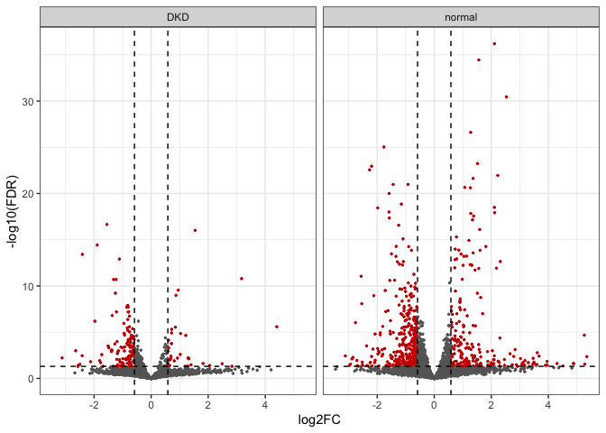<!-- -->

### DKD versus Normal

``` r
# convert test variables to factors
pData(geomx)$celltype <- with(pData(geomx), case_when(segment == 'PanCK-' ~ 'PanCKNeg_Tubule',
                             segment == 'PanCK+' ~ 'PanCKPos_Tubule',
                             TRUE ~ 'Glomeruli')) %>% factor(levels = c('PanCKNeg_Tubule','PanCKPos_Tubule','Glomeruli'))
pData(geomx)$class <- factor(pData(geomx)$class, c("normal", "DKD"))


# run LMM:
# formula follows conventions defined by the lme4 package
results2 <- c()
for(celltype in levels(pData(geomx)$celltype) ) {
    ind <- pData(geomx)$celltype == celltype
    mixedOutmc <-
        mixedModelDE(geomx[, ind],
                     elt = "log_q",
                     modelFormula = ~ class + (1 | slide),
                     groupVar = "class",
                     nCores = parallel::detectCores() -1 ,
                     multiCore = FALSE)

    this_genes <- colnames(mixedOutmc)
    
    r_test <- map_dfr(this_genes, ~mixedOutmc["lsmeans", .x] %>% as.data.frame %>% 
                       dplyr::rename(p_val = 'Pr...t..', log2FC = Estimate) %>% 
                       mutate(Gene = .x) %>% rownames_to_column('Contrast') 
                      ) %>% mutate(FDR = p.adjust(p_val, method = 'fdr')) ## FDR correction.

    results2 <- rbind(results2, mutate(r_test, Subset = celltype))
}
```

``` r
make_volcano_plot(results2, split_by = 'Subset', pval = 0.05, logfc = log2(1.5))
```

<!-- -->
