# Conversion of NanoStringsSet to Seurat object
### Author: Diana Vera Cruz
### Date: 03/31/2025

## Introduction

A `NanoStringsSet` object can be converted to a `Seurat` object for further
analysis or visualization. This is based in:
[Coercion of GeoMxSet to Seurat and SpatialExperiments](https://bioconductor.org/packages/release/bioc/vignettes/GeomxTools/inst/doc/GeomxSet_coercions.html)
but using the kidney dataset from this workshop.

## Requirements

This script uses the output GeoMx object from the QC script.

``` r
## Libraries
library(GeomxTools)
library(Seurat)
```

    ## Attaching SeuratObject

``` r
library(harmony) # devtools::install_github("immunogenomics/harmony")
```

    ## Loading required package: Rcpp

    ## Warning: package 'Rcpp' was built under R version 4.3.3

``` r
## Read tidy object: QC and filtered, but missing normalization. 
geomx <- readRDS('../env/tidy_geomx_obj.RDS')
## Normalization: Q3
geomx <- normalize(geomx, norm_method="quant", desiredQuantile = .75, toElt = "q_norm")


sc <- as.Seurat(geomx, normData = 'q_norm')
## If the data has Coordinates, include it here. 
sc <- as.Seurat(geomx, normData = 'q_norm', coordinates = c("ROI_Coordinate_X", "ROI_Coordinate_Y"))

## Assign an initial indentity to the cells.
Idents(sc) = 'region' ## Either the name of the column in metadata or the vector with values pers segment/ROI.
```

## Feature plots

### VlnPlots

You can use the VlnPlots, with any of the features per segment, either
from metadata or genes.

``` r
VlnPlot(sc, features = 'nCount_GeoMx', pt.size = 0.1, group.by = 'region') 
```

<!-- -->

``` r
VlnPlot(sc, features = 'area', pt.size = 0.1) 
```

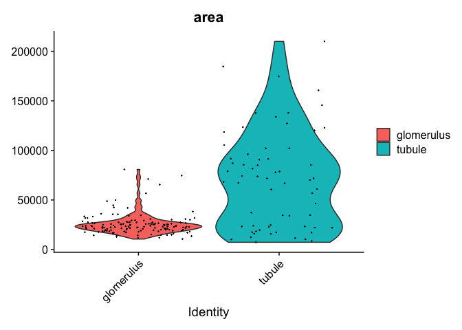<!-- -->

``` r
VlnPlot(sc, features = 'nCount_GeoMx', pt.size = 0.1, group.by = 'class') 
```

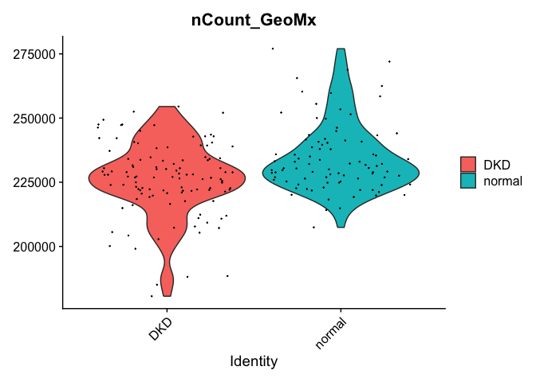<!-- -->

``` r
VlnPlot(sc, features = 'LYZ', group.by = 'region')
```

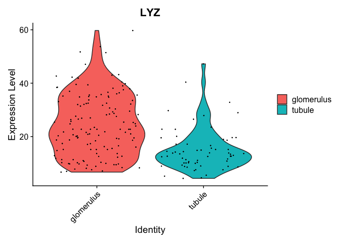<!-- -->

## Dimension reduction and variance.

### PCA

``` r
sc <- FindVariableFeatures(sc)
sc <- ScaleData(sc)
```

    ## Centering and scaling data matrix

``` r
sc <- RunPCA(sc, assay = "GeoMx", verbose = FALSE)
```

``` r
## Variance explained by each PC. Keep 90% of variance in first 50 PC.
x = (sc@reductions$pca@stdev)^2 / sum((sc@reductions$pca@stdev)^2) 
which( cumsum(x) > 0.9)[1] ## PC that first includes more than 90% of variance.
```

    ## [1] 28

``` r
## Screeplot -> SD per PC and biplots. 
ElbowPlot(sc, ndims = 50) + geom_vline(xintercept = which( cumsum(x) > 0.9)[1], linetype = 'dashed', color = 'orange')
```

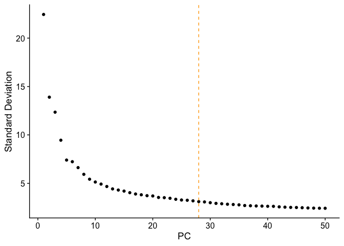<!-- -->

``` r
PCAPlot(sc, group.by = 'region', shape.by = 'class')
```

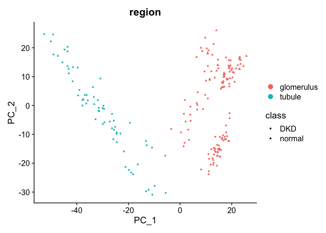<!-- -->

``` r
PCAPlot(sc, dims =c(3,4), group.by = 'region', shape.by = 'class')
```

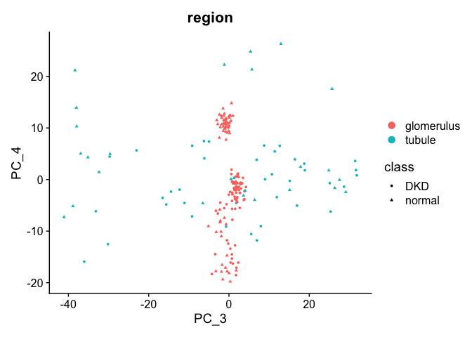<!-- -->

``` r
pcs = seq_len(28)
sc <- FindNeighbors(sc, reduction = "pca", dims = pcs)
```

    ## Computing nearest neighbor graph

    ## Computing SNN

``` r
sc <- FindClusters(sc, verbose = FALSE)
sc <- RunUMAP(sc, reduction = "pca", dims = pcs)
```

    ## Warning: The default method for RunUMAP has changed from calling Python UMAP via reticulate to the R-native UWOT using the cosine metric
    ## To use Python UMAP via reticulate, set umap.method to 'umap-learn' and metric to 'correlation'
    ## This message will be shown once per session

    ## 21:35:53 UMAP embedding parameters a = 0.9922 b = 1.112

    ## 21:35:53 Read 201 rows and found 28 numeric columns

    ## 21:35:53 Using Annoy for neighbor search, n_neighbors = 30

    ## 21:35:53 Building Annoy index with metric = cosine, n_trees = 50

    ## 0%   10   20   30   40   50   60   70   80   90   100%

    ## [----|----|----|----|----|----|----|----|----|----|

    ## **************************************************|
    ## 21:35:53 Writing NN index file to temp file /var/folders/4q/8psgnw2j0r123rc4vgzz6k7c0000gq/T//RtmpXby6Fb/file186320e2cbd2
    ## 21:35:53 Searching Annoy index using 1 thread, search_k = 3000
    ## 21:35:53 Annoy recall = 100%
    ## 21:35:53 Commencing smooth kNN distance calibration using 1 thread with target n_neighbors = 30
    ## 21:35:54 Initializing from normalized Laplacian + noise (using irlba)
    ## 21:35:54 Commencing optimization for 500 epochs, with 6912 positive edges
    ## 21:35:54 Using rng type: pcg
    ## 21:35:54 Optimization finished

``` r
DimPlot(sc, reduction = "umap", label = TRUE, group.by = "region", shape.by = 'class')
```

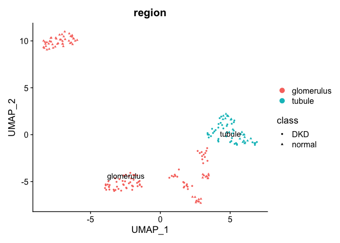<!-- -->

``` r
DimPlot(sc, reduction = "umap", label = TRUE, group.by = "slide_name")
```

<!-- -->

## Spatial Feature Plots

In this case, we will showcase the spatial feature plots for the one
slide, disease3.

``` r
SpatialFeaturePlot(sc[,sc$slide_name == "disease3"], features = "nCount_GeoMx", pt.size.factor = 8)
```

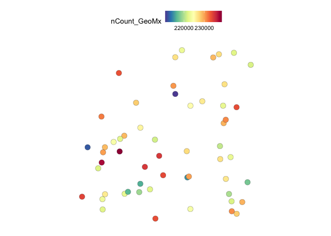<!-- -->

``` r
SpatialFeaturePlot(sc[,sc$slide_name == "disease3"], features = "NegProbe_pct", pt.size.factor = 8)
```

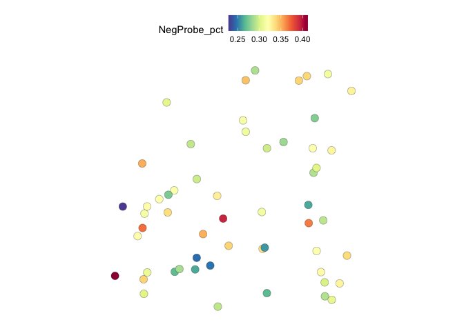<!-- -->

``` r
SpatialFeaturePlot(sc[,sc$slide_name == "disease3"], features = "LYZ", pt.size.factor = 8)
```

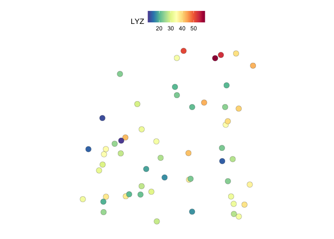<!-- -->

Nanostrings also developed a tool for this:
[SpatialOmicsOverlay](https://github.com/Nanostring-Biostats/SpatialOmicsOverlay)

## Batch correction

You can use other tools like `harmony` to correct data and visualize the
results.

``` r
## Run harmony.
sc <- RunHarmony(sc, group.by.vars = "slide_name", assay.use = "GeoMx", plot_convergence = TRUE)
```

    ## Transposing data matrix

    ## Initializing state using k-means centroids initialization

    ## Harmony 1/10

    ## Harmony 2/10

    ## Harmony 3/10

    ## Harmony 4/10

    ## Harmony 5/10

    ## Harmony 6/10

    ## Harmony converged after 6 iterations

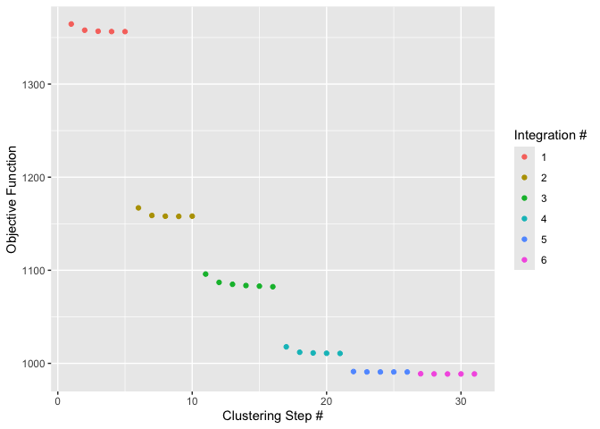<!-- -->

    ## Warning: Invalid name supplied, making object name syntactically valid. New object name is
    ## Seurat..ProjectDim.GeoMx.harmony; see ?make.names for more details on syntax validity

``` r
## Run clustering and UMAP.
sc <- FindNeighbors(sc, reduction = "harmony", dims = 1:20)
```

    ## Computing nearest neighbor graph

    ## Computing SNN

``` r
sc <- FindClusters(sc, resolution = 0.5)
```

    ## Modularity Optimizer version 1.3.0 by Ludo Waltman and Nees Jan van Eck
    ## 
    ## Number of nodes: 201
    ## Number of edges: 4699
    ## 
    ## Running Louvain algorithm...
    ## Maximum modularity in 10 random starts: 0.8369
    ## Number of communities: 5
    ## Elapsed time: 0 seconds

``` r
sc <- RunUMAP(sc, reduction = "harmony", dims = 1:20)
```

    ## 21:35:55 UMAP embedding parameters a = 0.9922 b = 1.112

    ## 21:35:55 Read 201 rows and found 20 numeric columns

    ## 21:35:55 Using Annoy for neighbor search, n_neighbors = 30

    ## 21:35:55 Building Annoy index with metric = cosine, n_trees = 50

    ## 0%   10   20   30   40   50   60   70   80   90   100%

    ## [----|----|----|----|----|----|----|----|----|----|

    ## **************************************************|
    ## 21:35:55 Writing NN index file to temp file /var/folders/4q/8psgnw2j0r123rc4vgzz6k7c0000gq/T//RtmpXby6Fb/file18632f95e0e3
    ## 21:35:55 Searching Annoy index using 1 thread, search_k = 3000
    ## 21:35:55 Annoy recall = 100%
    ## 21:35:56 Commencing smooth kNN distance calibration using 1 thread with target n_neighbors = 30
    ## 21:35:56 Initializing from normalized Laplacian + noise (using irlba)
    ## 21:35:56 Commencing optimization for 500 epochs, with 6840 positive edges
    ## 21:35:56 Using rng type: pcg
    ## 21:35:57 Optimization finished

``` r
DimPlot(sc, reduction = "umap", group.by = "slide_name")
```

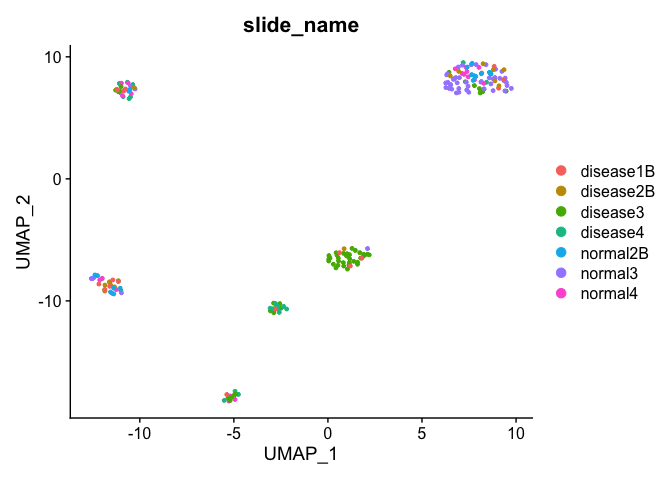<!-- -->

``` r
DimPlot(sc, reduction = "umap", group.by = "region", shape.by = 'class')
```

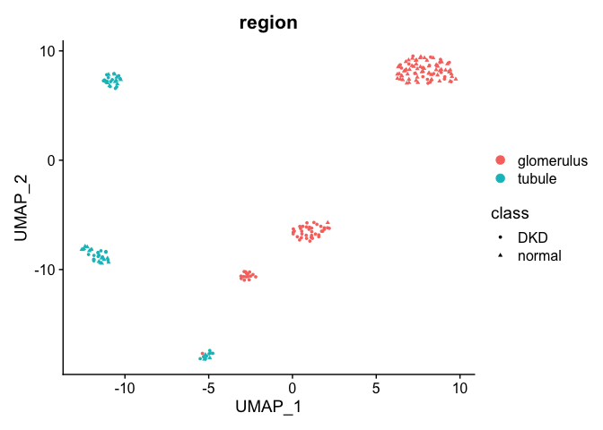<!-- -->
