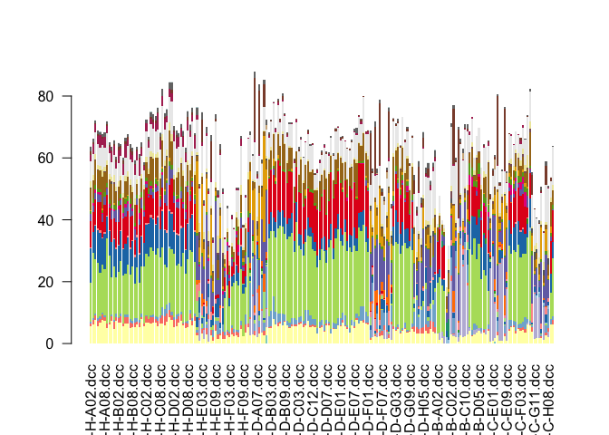
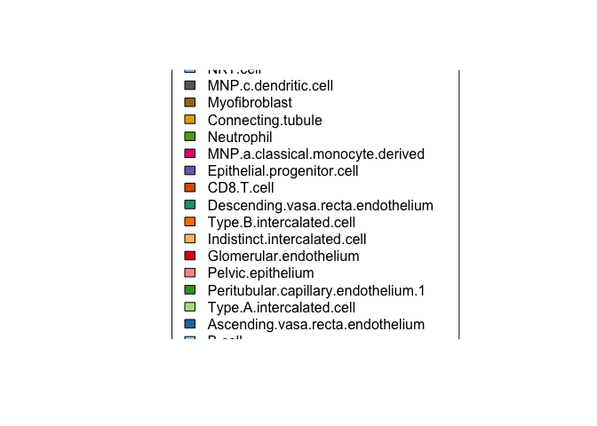
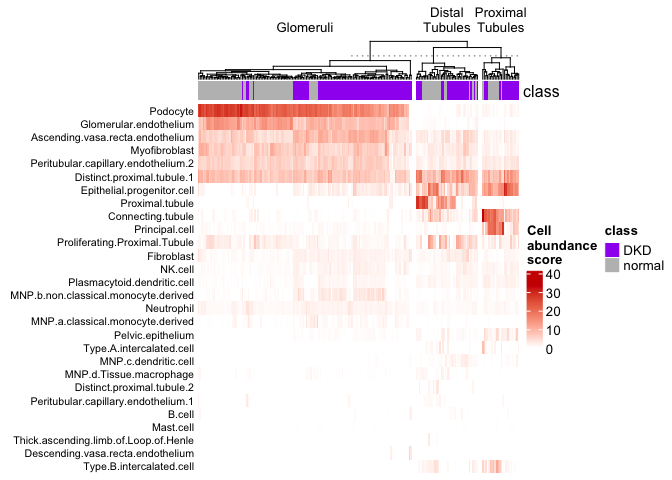

# Spatial deconvolution using `SpatialDecon`
### Author: Diana Vera Cruz
### Date: 03/31/2025


## Goal

Spatial Deconvolution infers cell abundance per cell type in each
segment, based on a reference matrix. This method does not incorporate
the spatial context for a given segment, rather infers cell types
abundances based on expression, and if nuclei counts are available, it
can be used to adjust the cell type abundances.

This script is based on [SpatialDecon vignette](https://bioconductor.org/packages/release/bioc/vignettes/SpatialDecon/inst/doc/SpatialDecon_vignette_NSCLC.html)
simplified and applied to the dataset for the workshop.


## Steps:

You can start with a “NanoStringGeoMxSet” or a “Seurat” object.

### 1. Calculate Background (Optional)

This requires the presence of Negative Probes in the dataset.

**Input** \* norm: Normalized expression matrix (Linear scale) \*
probepool: Probeset names \* negnames: Negative control probeset names

``` r
## Calculate background for data-set: Based in Negative Control Probes. For each probeset, one value in negnames. 
##Check the negative control probes in the dataset, NegProbe prefix expected for most probesets. 
dplyr::select( fData(geomx), Module, TargetName) %>% filter(grepl('NegProbe', TargetName))
```

    ##                         Module   TargetName
    ## NegProbe-WTX Hs_R_NGS_WTA_v1.0 NegProbe-WTX

``` r
bg = derive_GeoMx_background(norm = geomx@assayData$q_norm,
                             probepool = fData(geomx)$Module,
                             negnames = c("NegProbe-WTX"))
```

### 2. Cell Profile matrix

#### Predefined tables: Human/Mouse Atlas from Nanostring

``` r
## Obtain the Kidney Dataset (Closest set that resembles our data)
## Obtained from https://github.com/Nanostring-Biostats/CellProfileLibrary/tree/master
human_kidney <- download_profile_matrix(species = "Human",
                                       age_group = "Adult", 
                                       matrixname = "Kidney_HCA")


heatmap(sweep(human_kidney, 1, apply(human_kidney, 1, max), "/"),
        labRow = NA, margins = c(10, 5))
```

<!-- -->

``` r
#Heatmap(human_kidney, show_column_dend = F, show_row_dend = F, use_raster = T)
```

#### Custom reference matrix.

You can also create a custom reference matrix derived from a set you
annotated previously. The functions for this are included in <a
href="https://bioconductor.org/packages/release/bioc/vignettes/SpatialDecon/inst/doc/SpatialDecon_vignette_NSCLC.html"
class="uri">Bioconductor: SpatialDecon_vignette</a>

### Run deconvolution

``` r
res = runspatialdecon(
  object = geomx, 
  norm_elt = 'q_norm', 
  raw_elt = 'exprs',
  X = human_kidney, ## Reference matrix
  #cell_counts = sData(geomx)$nuclei ## Add if you have cell nuclei
)

beta_mx = res$beta
```

``` r
res = spatialdecon(
  norm = geomx@assayData$q_norm, 
  bg = bg,
  X = human_kidney, ## Reference matrix
  raw = geomx@assayData$exprs,
  cell_counts = sData(geomx)$nuclei 
)

beta_mx = res$beta
## Cell
```

``` r
TIL_barplot(mat = t(beta_mx), draw_legend = T)
```

<!-- --><!-- -->

``` r
Heatmap(t(beta_mx[,colSums(beta_mx) > 0]), show_column_names = F, show_row_dend = F,
        col = c('white', 'red3'), name = 'Cell\nabundance\nscore',
        show_parent_dend_line = T, row_names_side = 'left',
        #show_heatmap_legend = F, 
        row_names_gp = gpar(fontsize = 8), column_title_gp = gpar(fontsize = 10),
        top_annotation = HeatmapAnnotation(df = dplyr::select(sData(geomx), class), 
                                           col = list(class = c(DKD = 'purple', normal = 'grey'))),
        column_split = sData(geomx)$celltype)
```

<!-- -->
