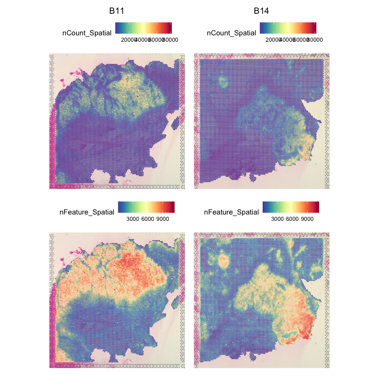
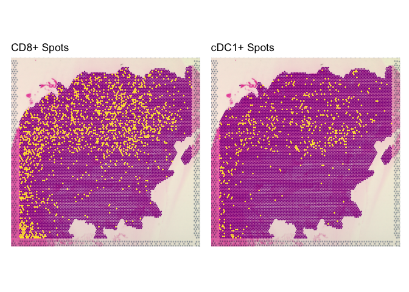
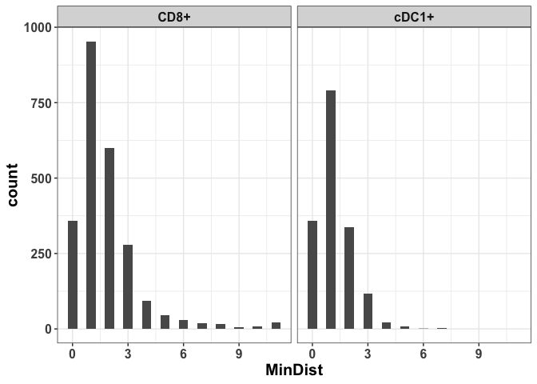
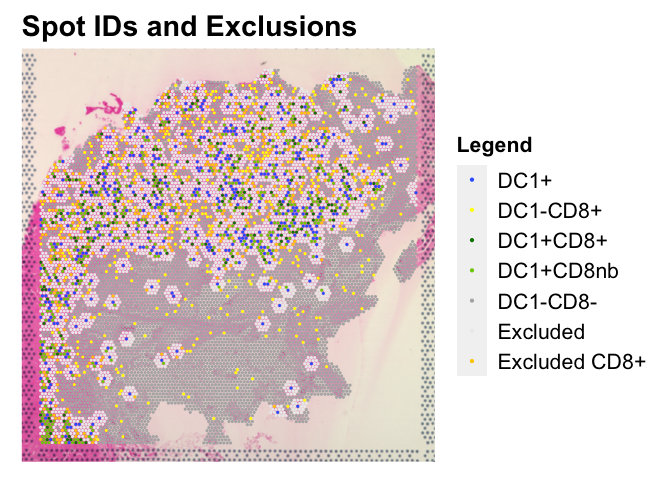
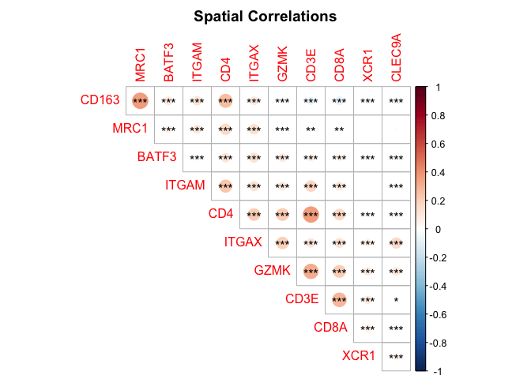
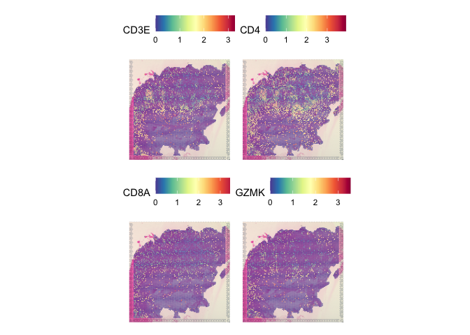
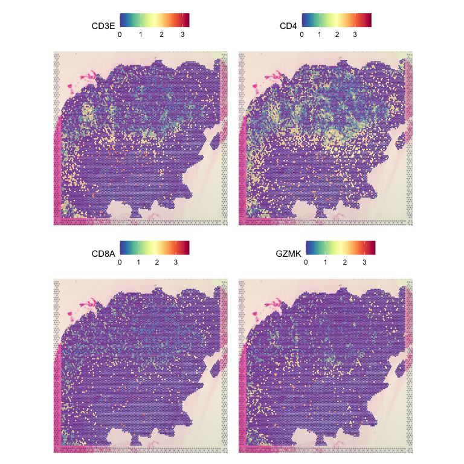

# 

## Tutorial

### Introduction

In this section, we will explore two samples from a study of the tumor
microenvironment. Data in this section are taken from [Ziblat et al
2024](https://www.cell.com/cell-reports/fulltext/S2211-1247(24)00469-8).
The example data are pre-processed and available [here](https://uchicago.box.com/s/pbsklrnue31wvq10qohlh7x9hev1nfaq) on
Box. The full data are also available from [GEO:
GSE238145](https://www.ncbi.nlm.nih.gov/geo/query/acc.cgi?acc=GSE238145).

------------------------------------------------------------------------

### Study Objective

In the original study, a primary objective was to compare the expression
of CD8 T-cells found near BATF3+ dendritic cells (cDC1s) to the
expression of CD8+ T-cells that were not near cDC1s. To do so, we needed
to develop some tools for identifying spots that we considered CD8+
cDC1+ and also to exclude CD8+ cDC1- spots that were too close to a
cDC1+ spot. We did this by building a distance function that took
advantage of features from Giotto.

### Load libraries and functions

``` r
library(Seurat)
library(dplyr)
library(RColorBrewer)
library(ggplot2)
library(patchwork)
library(Giotto)
library(corrplot)
#Set up Giotto
instrs = createGiottoInstructions(save_dir = getwd(),
                                  save_plot = TRUE,
                                  show_plot = FALSE,
                                  python_path = '/Users/jason/Software/miniconda3/envs/giotto/bin/pythonw')
#Load Giotto functions that are necessary for simplified spatial correlation analysis. Loading this way is not required if using the standard Giotto workflow for detecting spatially correlated genes. These functions all come directly from the original Giotto package but are not normally callable.
source("/Users/jason/Documents/Biocore/Spatial Transcriptomics Workshop 2025/code/giotto_functions.R")

#Load custom functions
source("/Users/jason/Documents/Biocore/Spatial Transcriptomics Workshop 2025/code/utility_functions.R")
```

### Load the data

We will load two samples from the paper to use here. We’ll use these to
showcase options for merging data at different stages.

``` r
data1 = readRDS("/Users/jason/Documents/Biocore/Spatial Transcriptomics Workshop 2025/TME_data_1.rds")
data2 = readRDS("/Users/jason/Documents/Biocore/Spatial Transcriptomics Workshop 2025/TME_data_2.rds")
```

### Merge the data

We merge the data just as we would with scRNA data.

``` r
data.merge = merge(data1, data2)
```

### Visualize the data

``` r
SpatialFeaturePlot(data.merge, c('nCount_Spatial','nFeature_Spatial'), pt.size.factor = 45, ncol = 2)
```

<!-- -->

### Distance Analysis with Giotto

We’ll use Giotto to help identify the distances between spots that
express different genes of interest. In the original study, this was
used to identify spots that expressed CD8 T-cell markers that were
either near or far from spots expressing cDC1 markers. First, we’ll
prepare the Giotto object.

### Prepare merged locations and counts for Giotto

Giotto’s functions are generally designed for single samples, but we can
build a synthetic set of coordinates for the merged data that preserves
the local relationships among spots while ensuring spots from different
tissues remain separate.

``` r
slicelist = names(data.merge@images)
locations=data.merge@images[[slicelist[1]]]@coordinates[,4:5]
locations$sample=slicelist[1]
for(i in 2:length(slicelist)){
  temp_loc=data.merge@images[[slicelist[i]]]@coordinates[,4:5]
  temp_loc$imagecol=temp_loc$imagecol+max(locations$imagecol)   #need to make sure things stay separate and avoid overlaps with coordinates
  temp_loc$imagerow=temp_loc$imagerow+max(locations$imagerow)
  temp_loc$sample=slicelist[i]
  locations=rbind(locations, temp_loc)
}

counts=data.merge@assays$Spatial@counts
giotto_obj=createGiottoObject(raw_exprs = counts, 
                                   spatial_locs = locations[,1:2], 
                                   norm_expr = data.merge$Spatial@data,
                                   instructions = instrs)
```


### Create the spatial network

Giotto has two primary options for building a spatial network of the
coordinates. The “Delaunay network” is recommended by default, but we
will run the KNN network (with k = 6), as this will exactly match the
visible adjacency of spots in the tissue images. Here, we’ll skip the
Delaunay step to save time.

``` r
#giotto_obj=createSpatialNetwork(gobject=giotto_obj, maximum_distance_delaunay = 500)   
giotto_obj=createSpatialKNNnetwork(gobject=giotto_obj, k=6)
```

### Identify the distance between spots of interest

Next, we will use a custom function (distfreq(), provided in
utility_functions.R) to find the shortest distances between spots from
two different groups. In the paper, we compared CD8+ spots and cDC1+
spots. We identified cDC1s as any spots expressing ITGAX and at least
one of XCR1, BATF3, or CLEC9A. Here, we will find these again, and we
will apply distfreq to identify the distances between each group.
(distfreq() returns the shortest distance from A to B, as well as the
shortest distance from B to A.)

``` r
data.merge$cd8 = sign(data.merge$Spatial@counts['CD8A',])
data.merge$dc1 = sign(data.merge$Spatial@counts['ITGAX',])*sign(apply(data.merge$Spatial@counts[c('XCR1','BATF3','CLEC9A'),], 2, sum))
table(data.merge$cd8)
```

    ## 
    ##     0     1 
    ## 19695  2433

``` r
table(data.merge$dc1)
```

    ## 
    ##     0     1 
    ## 20494  1634

``` r
table(data.merge$cd8*data.merge$dc1)
```

    ## 
    ##     0     1 
    ## 21770   358

Before we find the distance distributions, we’ll take a quick look at
where we observe CD8+ and cDC1+ spots in the tissue. We’ll use just
sample B11 for this step.

``` r
p1 = SpatialDimPlot(data.merge, group.by='cd8', images='B11',pt.size.factor=45)+NoLegend()+ggtitle('CD8+ Spots')+
  scale_fill_manual(values=c('darkmagenta','yellow'))
p2 = SpatialDimPlot(data.merge, group.by='dc1', images='B11',pt.size.factor=45)+NoLegend()+ggtitle('cDC1+ Spots')+
  scale_fill_manual(values=c('darkmagenta','yellow'))
p1+p2
```


Next, we build the distance distributions

``` r
cd8barcodes = names(which(data.merge$cd8 == 1))
dc1barcodes = names(which(data.merge$dc1 == 1))

cd8_dc1_dist=distfreq(giotto_obj, group1=cd8barcodes, group2=dc1barcodes, dmax=10, netname = 'knn_network')  #dmax is the maximum distance to check
data.merge$cd8_dc1_dist = data.merge$dc1_cd8_dist = rep(0,nrow(data.merge@meta.data))
data.merge$cd8_dc1_dist[names(cd8_dc1_dist$group1dist)] = as.numeric(cd8_dc1_dist$group1dist)
data.merge$dc1_cd8_dist[names(cd8_dc1_dist$group2dist)] = as.numeric(cd8_dc1_dist$group2dist)
```

We can then take a quick look at the overall distance distributions

``` r
dist_summary = data.frame(SpotType = c(rep('CD8+',length(cd8barcodes)), rep('cDC1+', length(dc1barcodes))),
                          MinDist = c(data.merge$cd8_dc1_dist[cd8barcodes], data.merge$dc1_cd8_dist[dc1barcodes]))
ggplot(dist_summary, aes(x=MinDist))+facet_wrap(vars(SpotType))+geom_histogram(binwidth = 0.5)+theme_bw()+
  theme(text=element_text(face='bold', size=15))
```



The basic histograms can be quite informative. First, note that the 0s
in each represent the CD8+ cDC1+ spots and have the same count in either
case, as one would expect. The second bar represents the number of CD8+
spots that are adjacent to a cDC1+ spot. This is *not* symmetric. This
is because a single spot can have 6 neighbors, and this difference
suggests that multiple CD8+ spots are likely to share a cDC1+ neighbor
than vice versa. We also see that the maximum distance for the CD8+ to
cDC1+ comparison is 10 or higher (this is a limit set in the function).
In contrast, the maximum distance from a cDC1+ spot to the nearest CD8+
spot is 7 grid spaces away. This tells us that we should expect to see
more CD8+ spots in isolated parts of the tissue, whereas cDC1+ spots
will be more concentrated near other cells.

### Visualize distribution in the tissues

Here, we get slightly more complicated, as we want to represent several
types of points at once: CD8+ cDC1+, CD8+ cDC1+ (neighbors), CD8+ cDC1-,
CD8- cDC1+, “Excluded” (spots within 2 spaces of a cDC1+), and CD8-
cDC1-. To do so, we’ll set up a feature (“Legend”) that tracks each
condition, and then we’ll build a color scheme to represent the values.
We’ll save some time here and use a function called dc1prep() that was
built for the publication (available in utility_functions.R). Below, we
show the result for sample B11 (TME_data_2).

``` r
data.merge = dc1prep(scobject = data.merge, 
                              giotto_object = giotto_obj,
                              cells = dc1barcodes, network = 'knn',
                              exclude=2)
colscheme=c('DC1+'='#3366FF',
            'DC1-CD8+'='#FFFF00',
            'DC1+CD8+'='#008000',
            'DC1+CD8nb'='#7ECB01',
            'DC1-CD8-'='#B2B2B2',
            'Excluded'='#ECECEC',
            'Excluded CD8+'='#FFCC00')

SpatialDimPlot(data.merge, group.by='Legend', pt.size.factor=45,images='B11')+
  scale_fill_manual(values=colscheme)+
  ggtitle('Spot IDs and Exclusions')+
  theme(title=element_text(size=18, face='bold'),legend.title=element_text(size=16),
        legend.text = element_text(size=16),legend.key.size = unit(8,'mm'))
```



#### A Note on Differential Expression Analysis

In the paper, the goal was to compare expression of CD8 T-cells close to
a cDC1+ spot (within 1 spot) to CD8+ spots at least 3 spaces away from a
cDC1. In the image above, this would be a comparison of the green spots
to the yellow spots. With Visium data, there are several possible
strategies for differential expression. One would be to use
FindMarkers() from Seurat like a basic scRNA analysis. This is also an
option here, but it can be difficult to decipher differences due to cell
type composition and differences in expression within specific cells.
Another option are tools that rely on deconvolution, such as “C-SIDE”
(discussed in the slides). Without a reliable scRNA reference or
confident deconvolution, we opted for a pseudobulk analysis. To do so,
we first normalized expression in each spot by the expression of CD8A,
and then proceeded with a standard bulk RNA analysis using limma-voom.

#### Spatial Correlations

Here, we’ll use the current dataset to also explore tools for spatially
correlated expression of pairs of genes of interest. This is implemented
by taking advantage of functions from the Giotto package. For an
in-depth overview, please refer to the [Giotto
Documentation](https://drieslab.github.io/Giotto_website/). Here, we’ll
run a truncated version of the workflow for detecting correlated genes
*de novo*. Instead, we’ll use a custom function called
“getSpatCorGeneSigValues()” (available in utility_functions.R) to check
correlations between markers for T-cells and Myeloid cells.

``` r
goi = c('CD8A','CD4','CD3E','GZMK','ITGAX','XCR1','BATF3','CLEC9A','ITGAM','MRC1','CD163')
giotto_obj = createSpatialNetwork(gobject = giotto_obj, minimum_k = 1)  #Rebuild to have a Delaunay network. Used by default for next step
cor_res = getSpatCorGeneSigValues(giotto_obj, goi)
corrplot(cor_res$cormat, p.mat=cor_res$pmat, order='AOE', diag=FALSE, col=rev(COL2('RdBu',200)), type='upper', title='Spatial Correlations', mar=c(0,0,2,0), sig.level=c(.001, .01, .05), insig='label_sig',method='circle',pch.cex=1)
```



This basic analysis suggests a positive spatial correlation between
dendritic cell and T-cell markers but a weak negative correlation
between CD8 T-cell markers and M2-like macrophage markers.

### Integration with scRNA reference

As with the mouse brain sample, we can also try to integrate this sample
data with a scRNA reference. Prior to publication, we did not have
access to a scRNA dataset that satisfied our requirements for both
immune and non-immune cells, so we did not perform a deconvolution-based
analysis for the paper. Here, we’ll take advantage of a scRNA dataset
([GSE222315](https://www.ncbi.nlm.nih.gov/geo/query/acc.cgi?acc=GSE222315))
from a 2024 [study](https://pubmed.ncbi.nlm.nih.gov/38428409/) of
bladder cancer. (To save time, we do this for just one sample). Note:
there are several other methods for deconvolution, including using
Seurat. We discuss some of these in the accompanying slide deck,
including STdeconvolve, SpaCET, SpatialDecon, and SPOTlight.

### Load and process the reference data

To speed things up, we have already pre-processed the reference data
with a new integration and annotation. We then downsampled the data,
since not all cells are needed for reference integration. This
downsampled object is available on our GitHub page.

``` r
refdata = readRDS('/Users/jason/Documents/Biocore/Spatial Transcriptomics Workshop 2025/GSE222315/data_integrated_ds.rds')
DefaultAssay(refdata) = 'RNA'
refdata = SCTransform(refdata)
refdata = RunPCA(refdata)
refdata = RunUMAP(refdata, dims=1:30)
DimPlot(refdata, group.by='celltype', label=TRUE, label.size=4, repel=TRUE)
```

``` r
refdata = readRDS('/Users/jason/Documents/Biocore/Spatial Transcriptomics Workshop 2025/GSE222315/data_integrated_ds.rds')
DefaultAssay(refdata) = 'SCT'
DimPlot(refdata, group.by='celltype', label=TRUE, label.size=4, repel=TRUE)
```


### Transfer anchors

We transfer anchors using the same steps as with the mouse brain
example. Seurat v5 also includes an option called “Robust Cell Type
Decomposition”, which is implemented with the spacexr package. We would
encourage readers to review that alternative method of deconvolution.

``` r
data1= SCTransform(data1, assay='Spatial', verbose = FALSE)
DefaultAssay(data1) = 'SCT'
data1 = RunPCA(data1)
anchors = FindTransferAnchors(reference = refdata, query = data1, normalization.method = 'SCT', verbose = FALSE)
predictions.assay = TransferData(anchorset=anchors, refdata=refdata$celltype, prediction.assay=TRUE, weight.reduction=data1[['pca']], dims=1:30, verbose = FALSE)
data1[['predictions']] = predictions.assay
```

Next, we’ll visualize the scores for some cell types of interest

``` r
DefaultAssay(data1) = 'predictions'
SpatialFeaturePlot(data1, features = c('CD8 T-cell','cDC1'), pt.size.factor=45)
```



With this updated method for scoring spots, we could potentially extend
the number of relevent loci in an updated analysis. Additionally, there
are packages available that can take prediciton scores or deconvolution
percentages into account to run differential expression analysis.

#### Recommended: Always validate deconvolution by checking additional known markers

In the plots above, we note that the CD8 T-cell predictions include
clusters of spots that were not CD8+ in previous plots. Below, we check
several common T-cell markers and find that none overlap with these
locations. This could indicate a problem with the scRNA reference that
requires further attention.

``` r
SpatialFeaturePlot(data.merge, features=c('CD3E', 'CD4', 'CD8A', 'GZMK'), images='B11', ncol = 2, pt.size.factor=45)
```

<!-- -->

### Spatial Correlations between cell types

Last, we can re-run our spatial correlation analysis using the new
prediction scores to see if there are significant associations between
cell types based on those values. We’ll add the prediction values to the
Giotto object and then re-run the correlation step.

``` r
giotto_cellpred = createGiottoObject(raw_exprs = data1$predictions@data, 
                                   spatial_locs = data1@images[[1]]@coordinates[,4:5],
                                   norm_expr = t(t(data1$predictions@data)/apply(data1$predictions@data,2,sum)),
                                   instructions = instrs)
giotto_cellpred = createSpatialNetwork(gobject = giotto_cellpred, minimum_k = 1)  #Build a basic Delaunay network.
```

``` r
cor_res_cells = getSpatCorGeneSigValues(giotto_cellpred, giotto_cellpred@gene_ID[-c(8,15)]) #Use all cell types, but skip PDGFRA+ and the "max" label
corrplot(cor_res_cells$cormat, p.mat=cor_res_cells$pmat, order='AOE', diag=FALSE, col=rev(COL2('RdBu',200)), type='upper', title='Spatial Correlations', mar=c(0,0,2,0), sig.level=c(.001, .01, .05), insig='label_sig',method='circle',pch.cex=1)
```


The results generally seem sensible and agree with visual inspection of
the prediction scores. They do not entirely agree with the relationship
we saw previously between T-cell markers and macrophages. This likely
reflects that “Macrophage” is a broad group, but the reference was not
annotated at a more specific level.

## Session info

The output from running ‘sessionInfo’ is shown below and details all
packages and version necessary to reproduce the results in this report.

    ## R version 4.2.2 (2022-10-31)
    ## Platform: x86_64-apple-darwin17.0 (64-bit)
    ## Running under: macOS Ventura 13.3.1
    ## 
    ## Matrix products: default
    ## LAPACK: /Library/Frameworks/R.framework/Versions/4.2/Resources/lib/libRlapack.dylib
    ## 
    ## locale:
    ## [1] en_US.UTF-8/en_US.UTF-8/en_US.UTF-8/C/en_US.UTF-8/en_US.UTF-8
    ## 
    ## attached base packages:
    ## [1] stats     graphics  grDevices utils     datasets  methods   base     
    ## 
    ## other attached packages:
    ##  [1] corrplot_0.92      Giotto_1.1.2       patchwork_1.1.2    ggplot2_3.4.4      tibble_3.1.8       RColorBrewer_1.1-3 dplyr_1.1.0       
    ##  [8] tidyr_1.3.0        Seurat_5.1.0       SeuratObject_5.0.2 sp_1.6-0          
    ## 
    ## loaded via a namespace (and not attached):
    ##   [1] utf8_1.2.3                  spatstat.explore_3.2-5      reticulate_1.28             tidyselect_1.2.0           
    ##   [5] htmlwidgets_1.6.1           grid_4.2.2                  Rtsne_0.16                  munsell_0.5.0              
    ##   [9] codetools_0.2-18            ica_1.0-3                   future_1.31.0               miniUI_0.1.1.1             
    ##  [13] withr_2.5.0                 spatstat.random_3.2-2       colorspace_2.1-0            progressr_0.13.0           
    ##  [17] Biobase_2.58.0              highr_0.10                  knitr_1.42                  rstudioapi_0.14            
    ##  [21] stats4_4.2.2                ROCR_1.0-11                 tensor_1.5                  listenv_0.9.0              
    ##  [25] MatrixGenerics_1.10.0       labeling_0.4.2              GenomeInfoDbData_1.2.9      polyclip_1.10-4            
    ##  [29] bit64_4.0.5                 farver_2.1.1                rprojroot_2.0.3             parallelly_1.34.0          
    ##  [33] vctrs_0.5.2                 generics_0.1.3              xfun_0.41                   R6_2.5.1                   
    ##  [37] doParallel_1.0.17           GenomeInfoDb_1.34.9         ggbeeswarm_0.7.1            clue_0.3-64                
    ##  [41] hdf5r_1.3.8                 RcppZiggurat_0.1.6          bitops_1.0-7                spatstat.utils_3.1-2       
    ##  [45] DelayedArray_0.24.0         promises_1.2.0.1            scales_1.2.1                beeswarm_0.4.0             
    ##  [49] gtable_0.3.1                Cairo_1.6-0                 globals_0.16.2              goftest_1.2-3              
    ##  [53] spam_2.9-1                  rlang_1.1.2                 GlobalOptions_0.1.2         splines_4.2.2              
    ##  [57] lazyeval_0.2.2              spatstat.geom_3.2-7         yaml_2.3.7                  reshape2_1.4.4             
    ##  [61] abind_1.4-5                 Rfast_2.0.7                 httpuv_1.6.9                tools_4.2.2                
    ##  [65] ellipsis_0.3.2              BiocGenerics_0.44.0         ggridges_0.5.4              Rcpp_1.0.10                
    ##  [69] plyr_1.8.8                  sparseMatrixStats_1.10.0    zlibbioc_1.44.0             purrr_1.0.1                
    ##  [73] RCurl_1.98-1.10             dbscan_1.1-11               deldir_1.0-6                pbapply_1.7-0              
    ##  [77] GetoptLong_1.0.5            cowplot_1.1.1               S4Vectors_0.36.1            zoo_1.8-11                 
    ##  [81] SummarizedExperiment_1.28.0 ggrepel_0.9.3               cluster_2.1.4               here_1.0.1                 
    ##  [85] magrittr_2.0.3              data.table_1.14.8           RSpectra_0.16-1             glmGamPoi_1.10.2           
    ##  [89] magick_2.7.3                scattermore_1.2             circlize_0.4.15             lmtest_0.9-40              
    ##  [93] RANN_2.6.1                  fitdistrplus_1.1-8          matrixStats_0.63.0          mime_0.12                  
    ##  [97] evaluate_0.20               xtable_1.8-4                readxl_1.4.2                fastDummies_1.7.3          
    ## [101] IRanges_2.32.0              gridExtra_2.3               shape_1.4.6                 compiler_4.2.2             
    ## [105] writexl_1.4.2               KernSmooth_2.23-20          crayon_1.5.2                htmltools_0.5.4            
    ## [109] later_1.3.0                 ComplexHeatmap_2.14.0       MASS_7.3-58.1               Matrix_1.6-5               
    ## [113] cli_3.6.0                   parallel_4.2.2              dotCall64_1.0-2             igraph_1.4.0               
    ## [117] GenomicRanges_1.50.2        pkgconfig_2.0.3             plotly_4.10.1               spatstat.sparse_3.0-3      
    ## [121] foreach_1.5.2               vipor_0.4.5                 XVector_0.38.0              stringr_1.5.0              
    ## [125] digest_0.6.31               sctransform_0.4.1           RcppAnnoy_0.0.20            spatstat.data_3.0-3        
    ## [129] rmarkdown_2.20              cellranger_1.1.0            leiden_0.4.3                uwot_0.1.14                
    ## [133] DelayedMatrixStats_1.20.0   shiny_1.7.4                 rjson_0.2.21                lifecycle_1.0.3            
    ## [137] nlme_3.1-160                jsonlite_1.8.4              viridisLite_0.4.1           fansi_1.0.4                
    ## [141] pillar_1.8.1                lattice_0.20-45             ggrastr_1.0.1               fastmap_1.1.0              
    ## [145] httr_1.4.4                  survival_3.4-0              glue_1.6.2                  png_0.1-8                  
    ## [149] iterators_1.0.14            bit_4.0.5                   stringi_1.7.12              RcppHNSW_0.4.1             
    ## [153] irlba_2.3.5.1               future.apply_1.10.0
