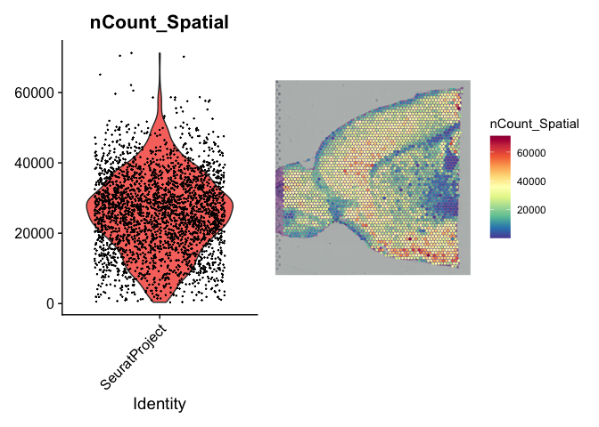
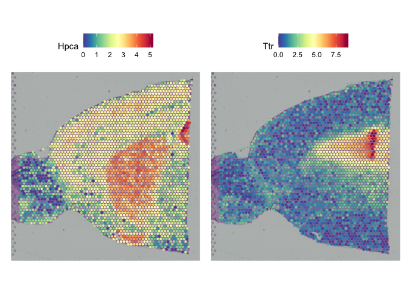
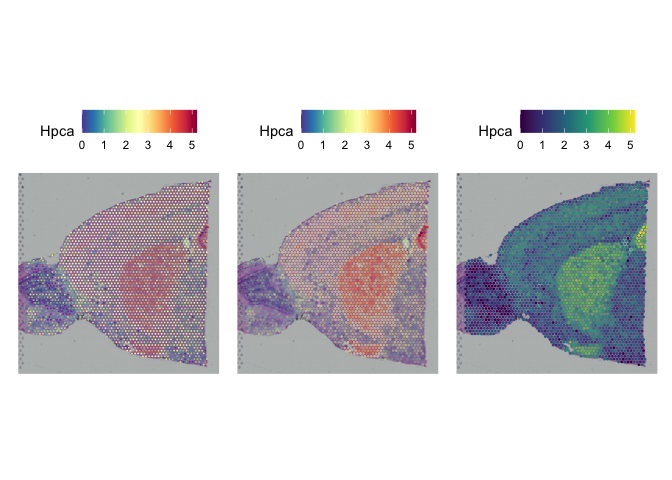
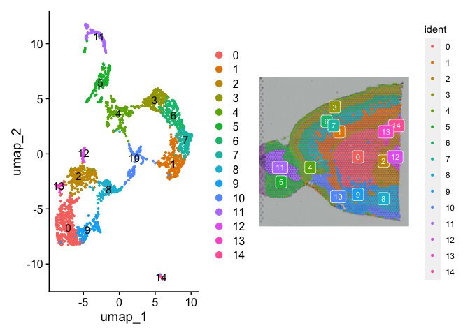
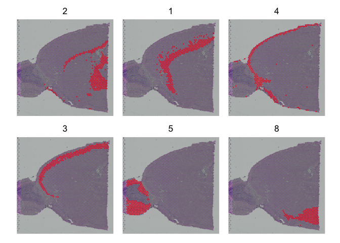
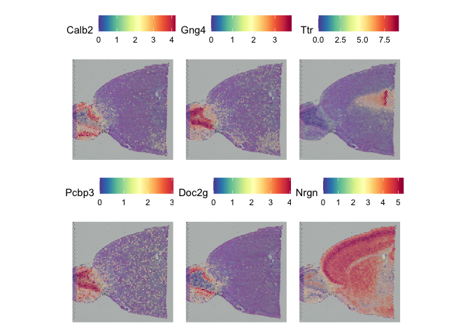
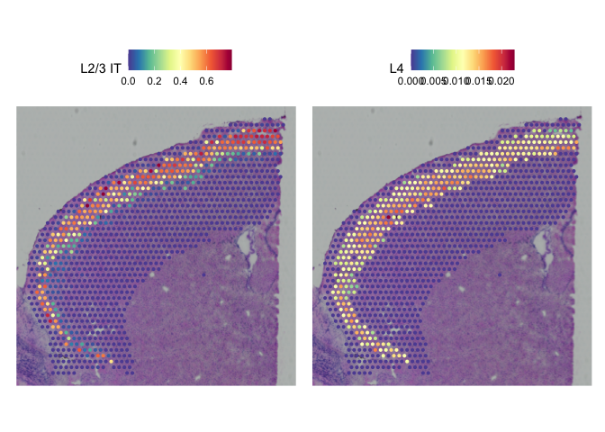

# 

## Tutorial

### Introduction

This tutorial accompanies materials from the CRI Spatial Transcriptomics
Workshop (April 2025). In this section, we walk through a modified
version of Seurat’s excellent vignette for [spatial data
analysis](https://satijalab.org/seurat/articles/spatial_vignette). We
have already downloaded the necessary Space Ranger outputs and provided
them via this tutorial’s GitHub page, but the same data can also be
obtained with the SeuratData package or directly from 10X.

### Obtaining other example data

If readers are interested in exploring other example data from 10X,
please visit their [data
repository](https://www.10xgenomics.com/datasets). After clicking on a
dataset link, navigate to “Output and supplemental files”. From there,
you will need to download the “Spatial imaging data” and “Feature /
barcode matrix HDF5 (filtered)” files to the same folder. The imaging
data will need to be decompressed, and the h5 file will need to be
renamed as “filtered_feature_bc_matrix.h5”. After doing so, you will
have the minimum requirements necessary to load the data into Seurat.

------------------------------------------------------------------------

### Load the data and explore the structure of the Seurat object

After loading data of a new type for the first time, it’s always helpful
to use the glimpse() function from the dplyr package to get a sense of
your data structure.

``` r
brain = Load10X_Spatial('/Users/jason/Documents/Biocore/Spatial Transcriptomics Workshop 2025/Data/Seurat Example/Anterior')
glimpse(brain)
```

    ## Formal class 'Seurat' [package "SeuratObject"] with 13 slots
    ##   ..@ assays      :List of 1
    ##   .. ..$ Spatial:Formal class 'Assay' [package "SeuratObject"] with 8 slots
    ##   ..@ meta.data   :'data.frame': 2695 obs. of  10 variables:
    ##   .. ..$ orig.ident      : Factor w/ 1 level "SeuratProject": 1 1 1 1 1 1 1 1 1 1 ...
    ##   .. ..$ nCount_Spatial  : num [1:2695] 13991 39797 29951 42333 35700 ...
    ##   .. ..$ nFeature_Spatial: int [1:2695] 4462 8126 6526 8190 8090 6518 7731 7255 5075 9241 ...
    ##   ..@ active.ident: Factor w/ 1 level "SeuratProject": 1 1 1 1 1 1 1 1 1 1 ...
    ##   .. ..- attr(*, "names")= chr [1:2695] "AAACAAGTATCTCCCA-1" "AAACACCAATAACTGC-1" "AAACAGAGCGACTCCT-1" "AAACAGCTTTCAGAAG-1" ...
    ##   ..@ graphs      : list()
    ##   ..@ neighbors   : list()
    ##   ..@ reductions  : list()
    ##   ..@ images      :List of 1
    ##   .. ..$ slice1:Formal class 'VisiumV1' [package "Seurat"] with 6 slots
    ##   ..@ project.name: chr "SeuratProject"
    ##   ..@ misc        : list()
    ##   ..@ version     :Classes 'package_version', 'numeric_version'  hidden list of 1
    ##   .. ..$ : int [1:3] 4 1 3
    ##   ..@ commands    : list()
    ##   ..@ tools       : list()

### Visualize basic features of the data

Next, we’ll visualize the distribution of counts and features in the
data. Note that the default assay for a spatial dataset is “Spatial” (in
contrast to a scRNA dataset where it is called “RNA”).

``` r
p1 = VlnPlot(brain, features = 'nCount_Spatial', pt.size = 0.1) + NoLegend()
p2 = SpatialFeaturePlot(brain, features = 'nCount_Spatial', pt.size.factor=1200)+theme(legend.position = 'right')
wrap_plots(p1,p2)
```



Most spots in this dataset have relatively high sequencing depth, but
some areas have lower expression. Note that these regions of lower
expression appear to follow the shape of the tissue and likely reflect
variation in cell counts or relevant differences in the biology. **Be on
the lookout for blocks of unusually low or high expression in a tissue
that do not follow the image underneath. For instance, if you see a
rectangular band of higher expression going down or across the center of
the image, this could indicate a problem during sample preparation**.

Next, let’s visualize the number of features per spot, as well as the
variation in nFeatures/nCounts. The latter is a simple proxy for
complexity and can tell us a bit more about the spots with lower counts.

``` r
p3 =  SpatialFeaturePlot(brain, features = 'nFeature_Spatial', pt.size.factor=1200)
brain$Genes_per_read = brain$nFeature_Spatial/brain$nCount_Spatial
p4 = SpatialFeaturePlot(brain, features = 'Genes_per_read', pt.size.factor=1200)
wrap_plots(p3, p4)
```


We can see that the tissue is feature-rich throughout. We also note that
low-count spots are not necessarily low-complexity.

#### A side question: Should we filter?

When should we filter spots out of a Visium dataset, and what parameters
should we use? With Visium data, we tend to be more forgiving of spots
with relatively low counts. Partly, this is because spots vary in how
many cells they include and, combined with variation in sequencing
depth, it is not uncommon to find spots with only a few hundred reads.
In general, I recommend checking the distribution of counts and
features, but primarily to identify sample-level problems. You typically
won’t need to filter individual spots out of a Visium dataset.

### Visualize specific genes

These functions work just as with scRNA data, except we visualize
expression directly on the tissue. Before running any normalizations,
let’s check the raw data.

``` r
SpatialFeaturePlot(brain, features = c("Hpca", "Ttr"), pt.size.factor=1200)
```


In the Seurat vignette, they recommend normalizing data prior to this
visualization, but there is a potential pitfall: with spatial data, we
often care about variation in the number of cells in a spot, not just
the change in expression per cell. We will generally still use
normalization, and it is necessary for downstream analyses, but it is
also worthwhile to check the raw counts. This is especially true for
genes with low expression.

### Normalize the data and re-visualize

We will use SCTransform to follow along with the Seurat tutorial, but
the basic log transformation with NormalizeData is often more intuitive.

``` r
brain = SCTransform(brain, assay = 'Spatial', verbose = FALSE)  #Note that we have to specify the assay, since Seurat expects "RNA" by default.
```

``` r
SpatialFeaturePlot(brain, features = c("Hpca", "Ttr"), pt.size.factor=1200)  #Note that Seurat automatically changes the assay to SCT after SCTransform
```



#### Customize visualizations

Often, you will want to modify some of the parameters in
SpatialFeaturePlot. For instance, if you have a smaller tissue, you may
need to reduce pt.size.factor to fill the space more evenly. In
contrast, larger tissues might require increasing the pt.size.factor for
a better figure. The alpha parameter can also be helpful to bring higher
expression spots to the foreground. Last, you can customize your
visualizations with familiar ggplot functions and tricks.

``` r
p5 = SpatialFeaturePlot(brain, features = "Hpca", pt.size.factor = 800)
p6 = SpatialFeaturePlot(brain, features = "Hpca", alpha = c(0.1, 1), pt.size.factor=1200)
p7 = SpatialFeaturePlot(brain, features = 'Hpca', pt.size.factor=1200)+
  scale_fill_continuous(type = 'viridis')
p5 + p6 + p7
```



------------------------------------------------------------------------

### Dimensionality Reduction

We can handle the data just as we would treat a scRNA object, using all
of the typical Seurat functions to build a PCA and UMAP visualization.
With SpatialDimPlot we can then visualize clusters within the tissue.
**Note: clusters in spatial data reflect not just cell type but
combinations of multiple cell types and spatial context. Annotating
clusters in spatial data is often more challenging than annotating scRNA
data.**

``` r
brain = RunPCA(brain, assay = "SCT", verbose = FALSE)
brain = FindNeighbors(brain, reduction = "pca", dims = 1:30)
brain = FindClusters(brain, verbose = FALSE)
brain = RunUMAP(brain, reduction = "pca", dims = 1:30)
p8 = DimPlot(brain, reduction = 'umap', label = TRUE)
p9 = SpatialDimPlot(brain, label = TRUE, label.size=3, pt.size.factor=1200)
p8 + p9
```



As noted in the Seurat vignette, showing many overlapping colors can be
difficult to read (and this will be even more difficult in a tissue with
more overlapping cell types). One option is the “cells.highlight”
argument in SpatialDimPlot:

``` r
SpatialDimPlot(brain, cells.highlight = CellsByIdentities(object = brain, idents = c(2, 1, 4, 3,
    5, 8)), facet.highlight = TRUE, ncol = 3, pt.size.factor=1200)
```



#### Additional customization options

As noted earlier, we can also usee ggplot functions, such as
scale_fill_manual, to modify the colors. We’ll pick custom colors for 6
clusters used in the previous plot, and we’ll set the rest of the
clusters to NA

``` r
brewcols = rep(NA, 15)
brewcols[c(2, 1, 4, 3, 5, 8)] = brewer.pal(6, 'Set1')  #Pull 6 colors from Set1 fro RColorBrewer  
SpatialDimPlot(brain, label=TRUE, label.size=3, pt.size.factor=1200)+
  scale_fill_manual(values = brewcols)
```


### Identify Markers

The function FindMarkers() works just as it would with scRNA data, and
is one way that we can identify differences between regions in the
tissue. In the Seurat vignette, they use this to compare clusters.
Another option they introduce is FindSpatiallyVariableFeatures(). This
function looks for features whose expression correlates with their
location. We copy their example below but also note (as they do) that
many packages tackle this concept in different ways. (Note: this
function can be quite slow)

``` r
brain = FindSpatiallyVariableFeatures(brain, assay = "SCT", features = VariableFeatures(brain)[1:1000],
    selection.method = "moransi", verbose = FALSE)
top.features = head(SpatiallyVariableFeatures(brain, selection.method = "moransi"), 6)
SpatialFeaturePlot(brain, features = top.features, ncol = 3, alpha = c(0.1, 1), pt.size.factor=1200)
```



------------------------------------------------------------------------

### Integration with a single-cell reference

Seurat’s workflow for integration provides a powerful way to transfer
information from a scRNA dataset onto the spots in a spatial dataset.
This serves several functions:

 -1. It can help identify the key cell types associated with clusters or
regions in the spatial data

 -2. It can serve as a proxy for deconvolution (more in next section)
when many cell types are present

**Note: it is important that your scRNA reference is a good match for
your spatial data. scRNA data is often obtained after cell sorting to
remove unwanted material, but these excluded cells may still be present
in spatial data.**

We will start by subsetting the dataset to just the cortex region, as
done in the Seurat vignette.

``` r
# Add coordinates as features to the metadata (necessary because of how the data were loaded in our example. Not necessary with LoadData)
brain$imagerow = brain@images$slice1@coordinates$row
brain$imagecol = brain@images$slice1@coordinates$col
cortex = subset(brain, idents = c(1, 2, 3, 4, 6, 7))
cortex = subset(cortex, imagerow < 30 | imagecol < 90)  #These values are modified from the Seurat vignette due to the issue above
cortex = subset(cortex, imagerow < 55 & imagecol > 20)
cortex = SCTransform(cortex, assay = "Spatial", verbose = FALSE)
cortex = RunPCA(cortex, verbose=FALSE)
```

Next, we load the reference data and prepare it for integration (we skip
some steps for visualization from the original vignette)

``` r
allen_reference = readRDS("/Users/jason/Documents/Biocore/Spatial Transcriptomics Workshop 2025/Data/Seurat Example/allen_cortex.rds")
allen_reference = SCTransform(allen_reference, verbose = FALSE)
allen_reference = RunPCA(allen_reference, verbose = FALSE)
```

Finally, we identify the transfer anchors and apply them to the spatial
data

``` r
anchors = FindTransferAnchors(reference = allen_reference, query = cortex, normalization.method = "SCT")
predictions.assay = TransferData(anchorset = anchors, refdata = allen_reference$subclass, prediction.assay = TRUE,
    weight.reduction = cortex[["pca"]], dims = 1:30)
cortex[["predictions"]] = predictions.assay
```

``` r
DefaultAssay(cortex) = "predictions"
SpatialFeaturePlot(cortex, features = c("L2/3 IT", "L4"), pt.size.factor = 1200, ncol = 2, crop = TRUE)
```



### Conclusion

This concludes the initial introduction to spatial data with Seurat. We
encourage visiting the [Seurat
Vignette](https://satijalab.org/seurat/articles/spatial_vignette) for
additional details.

## Session info

The output from running ‘sessionInfo’ is shown below and details all
packages and version necessary to reproduce the results in this report.

    ## R version 4.2.2 (2022-10-31)
    ## Platform: x86_64-apple-darwin17.0 (64-bit)
    ## Running under: macOS Ventura 13.3.1
    ## 
    ## Matrix products: default
    ## LAPACK: /Library/Frameworks/R.framework/Versions/4.2/Resources/lib/libRlapack.dylib
    ## 
    ## locale:
    ## [1] en_US.UTF-8/en_US.UTF-8/en_US.UTF-8/C/en_US.UTF-8/en_US.UTF-8
    ## 
    ## attached base packages:
    ## [1] stats     graphics  grDevices utils     datasets  methods   base     
    ## 
    ## other attached packages:
    ##  [1] corrplot_0.92      Giotto_1.1.2       patchwork_1.1.2    ggplot2_3.4.4      tibble_3.1.8       RColorBrewer_1.1-3 dplyr_1.1.0       
    ##  [8] tidyr_1.3.0        Seurat_5.1.0       SeuratObject_5.0.2 sp_1.6-0          
    ## 
    ## loaded via a namespace (and not attached):
    ##   [1] utf8_1.2.3                  spatstat.explore_3.2-5      reticulate_1.28             tidyselect_1.2.0           
    ##   [5] htmlwidgets_1.6.1           grid_4.2.2                  Rtsne_0.16                  munsell_0.5.0              
    ##   [9] codetools_0.2-18            ica_1.0-3                   future_1.31.0               miniUI_0.1.1.1             
    ##  [13] withr_2.5.0                 spatstat.random_3.2-2       colorspace_2.1-0            progressr_0.13.0           
    ##  [17] Biobase_2.58.0              highr_0.10                  knitr_1.42                  rstudioapi_0.14            
    ##  [21] stats4_4.2.2                ROCR_1.0-11                 tensor_1.5                  listenv_0.9.0              
    ##  [25] MatrixGenerics_1.10.0       labeling_0.4.2              GenomeInfoDbData_1.2.9      polyclip_1.10-4            
    ##  [29] bit64_4.0.5                 farver_2.1.1                rprojroot_2.0.3             parallelly_1.34.0          
    ##  [33] vctrs_0.5.2                 generics_0.1.3              xfun_0.41                   R6_2.5.1                   
    ##  [37] doParallel_1.0.17           GenomeInfoDb_1.34.9         ggbeeswarm_0.7.1            clue_0.3-64                
    ##  [41] hdf5r_1.3.8                 RcppZiggurat_0.1.6          bitops_1.0-7                spatstat.utils_3.1-2       
    ##  [45] DelayedArray_0.24.0         promises_1.2.0.1            scales_1.2.1                beeswarm_0.4.0             
    ##  [49] gtable_0.3.1                Cairo_1.6-0                 globals_0.16.2              goftest_1.2-3              
    ##  [53] spam_2.9-1                  rlang_1.1.2                 GlobalOptions_0.1.2         splines_4.2.2              
    ##  [57] lazyeval_0.2.2              spatstat.geom_3.2-7         yaml_2.3.7                  reshape2_1.4.4             
    ##  [61] abind_1.4-5                 Rfast_2.0.7                 httpuv_1.6.9                tools_4.2.2                
    ##  [65] ellipsis_0.3.2              BiocGenerics_0.44.0         ggridges_0.5.4              Rcpp_1.0.10                
    ##  [69] plyr_1.8.8                  sparseMatrixStats_1.10.0    zlibbioc_1.44.0             purrr_1.0.1                
    ##  [73] RCurl_1.98-1.10             dbscan_1.1-11               deldir_1.0-6                pbapply_1.7-0              
    ##  [77] GetoptLong_1.0.5            cowplot_1.1.1               S4Vectors_0.36.1            zoo_1.8-11                 
    ##  [81] SummarizedExperiment_1.28.0 ggrepel_0.9.3               cluster_2.1.4               here_1.0.1                 
    ##  [85] magrittr_2.0.3              data.table_1.14.8           RSpectra_0.16-1             glmGamPoi_1.10.2           
    ##  [89] magick_2.7.3                scattermore_1.2             circlize_0.4.15             lmtest_0.9-40              
    ##  [93] RANN_2.6.1                  fitdistrplus_1.1-8          matrixStats_0.63.0          mime_0.12                  
    ##  [97] evaluate_0.20               xtable_1.8-4                readxl_1.4.2                fastDummies_1.7.3          
    ## [101] IRanges_2.32.0              gridExtra_2.3               shape_1.4.6                 compiler_4.2.2             
    ## [105] writexl_1.4.2               KernSmooth_2.23-20          crayon_1.5.2                htmltools_0.5.4            
    ## [109] later_1.3.0                 ComplexHeatmap_2.14.0       MASS_7.3-58.1               Matrix_1.6-5               
    ## [113] cli_3.6.0                   parallel_4.2.2              dotCall64_1.0-2             igraph_1.4.0               
    ## [117] GenomicRanges_1.50.2        pkgconfig_2.0.3             plotly_4.10.1               spatstat.sparse_3.0-3      
    ## [121] foreach_1.5.2               vipor_0.4.5                 XVector_0.38.0              stringr_1.5.0              
    ## [125] digest_0.6.31               sctransform_0.4.1           RcppAnnoy_0.0.20            spatstat.data_3.0-3        
    ## [129] rmarkdown_2.20              cellranger_1.1.0            leiden_0.4.3                uwot_0.1.14                
    ## [133] DelayedMatrixStats_1.20.0   shiny_1.7.4                 rjson_0.2.21                lifecycle_1.0.3            
    ## [137] nlme_3.1-160                jsonlite_1.8.4              viridisLite_0.4.1           fansi_1.0.4                
    ## [141] pillar_1.8.1                lattice_0.20-45             ggrastr_1.0.1               fastmap_1.1.0              
    ## [145] httr_1.4.4                  survival_3.4-0              glue_1.6.2                  png_0.1-8                  
    ## [149] iterators_1.0.14            bit_4.0.5                   stringi_1.7.12              RcppHNSW_0.4.1             
    ## [153] irlba_2.3.5.1               future.apply_1.10.0
